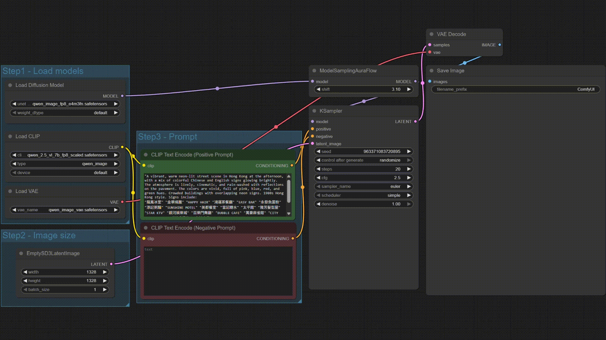
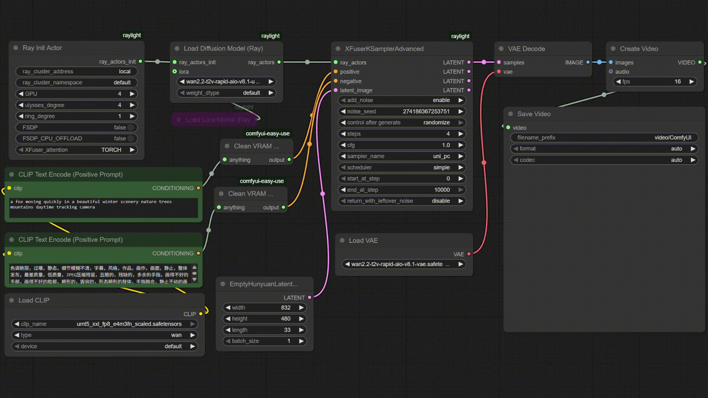

# LLM Scaler

LLM Scaler is an GenAI solution for text generation, image generation, video generation etc. running on [Intel® Arc™ Pro B60 GPUs](https://www.intel.com/content/www/us/en/products/docs/discrete-gpus/arc/workstations/b-series/overview.html). LLM Scalar leverages standard frameworks such as vLLM, ComfyUI, Xinference etc and ensures the best performance for State-of-Art GenAI models running on Arc Pro B60 GPUs.

---

## Latest Update
- [2025.11] We released `intel/llm-scaler-vllm:0.10.2-b6` to support Qwen3-VL (Dense/MoE), Qwen3-Omni, Qwen3-30B-A3B (MoE Int4), MinerU 2.5, ERNIE-4.5-vl etc. 
- [2025.11] We released `intel/llm-scaler-vllm:0.10.2-b5` to support gpt-oss models and released `intel/llm-scaler-omni:0.1.0-b3` to support more ComfyUI workflows, and Windows installation.
- [2025.10] We released `intel/llm-scaler-omni:0.1.0-b2` to support more models with ComfyUI workflows and Xinference.
- [2025.09] We released `intel/llm-scaler-vllm:0.10.0-b3` to support more models (MinerU, MiniCPM-v-4.5 etc), and released `intel/llm-scaler-omni:0.1.0-b1` to enable first omni GenAI models using ComfyUI and Xinference on Arc Pro B60 GPU.
- [2025.08] We released `intel/llm-scaler-vllm:1.0`.

## LLM Scaler vLLM

`llm-scaler-vllm` supports running text generation models using vLLM, featuring: 

- ***CCL*** support (P2P or USM)
- ***INT4*** and ***FP8*** quantized online serving
- ***Embedding*** and ***Reranker*** model support
- ***Multi-Modal*** model support
- ***Omni*** model support
- ***Tensor Parallel***, ***Pipeline Parallel*** and ***Data Parallel***
- Finding maximum Context Length
- Multi-Modal WebUI
- BPE-Qwen tokenizer

Please follow the instructions in the [Getting Started](vllm/README.md/#1-getting-started-and-usage) to use `llm-scaler-vllm`. 

### Supported Models

| Category             | Model Name                                 | FP16 | Dynamic Online FP8 | Dynamic Online Int4 | MXFP4 | Notes                     |
|----------------------|--------------------------------------------|------|--------------------|----------------------|-------|---------------------------|
| Language Model       | openai/gpt-oss-20b                         |      |                    |                      |   ✅   |                           |
| Language Model       | openai/gpt-oss-120b                        |      |                    |                      |   ✅   |                           |
| Language Model       | deepseek-ai/DeepSeek-R1-Distill-Qwen-1.5B  |  ✅  |         ✅         |          ✅          |       |                           |
| Language Model       | deepseek-ai/DeepSeek-R1-Distill-Qwen-7B    |  ✅  |         ✅         |          ✅          |       |                           |
| Language Model       | deepseek-ai/DeepSeek-R1-Distill-Llama-8B   |  ✅  |         ✅         |          ✅          |       |                           |
| Language Model       | deepseek-ai/DeepSeek-R1-Distill-Qwen-14B   |  ✅  |         ✅         |          ✅          |       |                           |
| Language Model       | deepseek-ai/DeepSeek-R1-Distill-Qwen-32B   |  ✅  |         ✅         |          ✅          |       |                           |
| Language Model       | deepseek-ai/DeepSeek-R1-Distill-Llama-70B  |  ✅  |         ✅         |          ✅          |       |                           |
| Language Model       | deepseek-ai/DeepSeek-R1-0528-Qwen3-8B      |  ✅  |         ✅         |          ✅          |       |                           |
| Language Model       | deepseek-ai/DeepSeek-V2-Lite               |  ✅  |         ✅         |                      |       | export VLLM_MLA_DISABLE=1 |
| Language Model       | deepseek-ai/deepseek-coder-33b-instruct    |  ✅  |         ✅         |          ✅          |       |                           |
| Language Model       | Qwen/Qwen3-8B                              |  ✅  |         ✅         |          ✅          |       |                           |
| Language Model       | Qwen/Qwen3-14B                             |  ✅  |         ✅         |          ✅          |       |                           |
| Language Model       | Qwen/Qwen3-32B                             |  ✅  |         ✅         |          ✅          |       |                           |
| Language MOE Model   | Qwen/Qwen3-30B-A3B                         |  ✅  |         ✅         |          ✅          |       |                           |
| Language MOE Model   | Qwen/Qwen3-235B-A22B                       |      |         ✅         |                      |       |                           |
| Language MOE Model   | Qwen/Qwen3-Coder-30B-A3B-Instruct          |  ✅  |         ✅         |          ✅          |       |                           |
| Language Model       | Qwen/QwQ-32B                               |  ✅  |         ✅         |          ✅          |       |                           |
| Language Model       | mistralai/Ministral-8B-Instruct-2410       |  ✅  |         ✅         |          ✅          |       |                           |
| Language Model       | mistralai/Mixtral-8x7B-Instruct-v0.1       |  ✅  |         ✅         |          ✅          |       |                           |
| Language Model       | meta-llama/Llama-3.1-8B                    |  ✅  |         ✅         |          ✅          |       |                           |
| Language Model       | meta-llama/Llama-3.1-70B                   |  ✅  |         ✅         |          ✅          |       |                           |
| Language Model       | baichuan-inc/Baichuan2-7B-Chat             |  ✅  |         ✅         |          ✅          |       | with chat_template        |
| Language Model       | baichuan-inc/Baichuan2-13B-Chat            |  ✅  |         ✅         |          ✅          |       | with chat_template        |
| Language Model       | THUDM/CodeGeex4-All-9B                     |  ✅  |         ✅         |          ✅          |       | with chat_template        |
| Language Model       | zai-org/GLM-4-9B-0414                      |      |         ✅        |                      |       | use bfloat16 |
| Language Model       | zai-org/GLM-4-32B-0414                     |      |         ✅        |                      |       | use bfloat16 |
| Language MOE Model   | zai-org/GLM-4.5-Air                        |  ✅  |         ✅         |                      |       |                           |
| Language Model       | ByteDance-Seed/Seed-OSS-36B-Instruct       |  ✅  |         ✅         |          ✅          |       |                           |
| Language Model       | tencent/Hunyuan-0.5B-Instruct              |  ✅  |         ✅         |          ✅          |       |  follow the guide in [here](#31-how-to-use-hunyuan-7b-instruct)   |
| Language Model       | tencent/Hunyuan-7B-Instruct                |  ✅  |         ✅         |          ✅          |       |  follow the guide in [here](#31-how-to-use-hunyuan-7b-instruct)   |
| Multimodal Model     | Qwen/Qwen2-VL-7B-Instruct                  |  ✅  |         ✅         |          ✅          |       |                           |
| Multimodal Model     | Qwen/Qwen2.5-VL-7B-Instruct                |  ✅  |         ✅         |          ✅          |       |                           |
| Multimodal Model     | Qwen/Qwen2.5-VL-32B-Instruct               |  ✅  |         ✅         |          ✅          |       |                           |
| Multimodal Model     | Qwen/Qwen2.5-VL-72B-Instruct               |  ✅  |         ✅         |          ✅          |       |                           |
| Multimodal Model     | Qwen/Qwen3-VL-4B-Instruct                  |  ✅  |         ✅         |          ✅          |       |                           |
| Multimodal Model     | Qwen/Qwen3-VL-8B-Instruct                  |  ✅  |         ✅         |          ✅          |       |                           |
| Multimodal MOE Model | Qwen/Qwen3-VL-30B-A3B-Instruct             |  ✅  |         ✅         |          ✅          |       |                           |
| Multimodal Model     | openbmb/MiniCPM-V-2_6                      |  ✅  |         ✅         |          ✅          |       |                           |
| Multimodal Model     | openbmb/MiniCPM-V-4                        |  ✅  |         ✅         |          ✅          |       |                           |
| Multimodal Model     | openbmb/MiniCPM-V-4_5                      |  ✅  |         ✅         |          ✅          |       |                           |
| Multimodal Model     | OpenGVLab/InternVL2-8B                     |  ✅  |         ✅         |          ✅          |       |                           |
| Multimodal Model     | OpenGVLab/InternVL3-8B                     |  ✅  |         ✅         |          ✅          |       |                           |
| Multimodal Model     | OpenGVLab/InternVL3_5-8B                   |  ✅  |         ✅         |          ✅          |       |                           |
| Multimodal MOE Model | OpenGVLab/InternVL3_5-30B-A3B              |  ✅  |         ✅         |          ✅          |       |                           |
| Multimodal Model     | rednote-hilab/dots.ocr                     |  ✅  |         ✅         |          ✅          |       |                           |
| Multimodal Model     | ByteDance-Seed/UI-TARS-7B-DPO              |  ✅  |         ✅         |          ✅          |       |                           |
| Multimodal Model     | google/gemma-3-12b-it                      |      |         ✅         |                      |       |  use bfloat16  |
| Multimodal Model     | THUDM/GLM-4v-9B                            |  ✅  |         ✅         |          ✅         |       |  with --hf-overrides and chat_template  |
| Multimodal Model     | zai-org/GLM-4.1V-9B-Base                   |  ✅  |         ✅         |          ✅          |       |                           |
| Multimodal Model     | zai-org/GLM-4.1V-9B-Thinking               |  ✅  |         ✅         |          ✅          |       |                           |
| Multimodal Model     | zai-org/Glyph                              |  ✅  |         ✅         |          ✅          |       |                           |
| Multimodal Model     | opendatalab/MinerU2.5-2509-1.2B            |  ✅  |         ✅         |          ✅          |       |                           |
| omni                 | Qwen/Qwen2.5-Omni-7B                       |  ✅  |         ✅         |          ✅          |       |                           |
| omni                 | Qwen/Qwen3-Omni-30B-A3B-Instruct           |  ✅  |         ✅         |          ✅          |       |                           |
| audio                | openai/whisper-medium                      |  ✅  |         ✅         |          ✅          |       |                           |
| audio                | openai/whisper-large-v3                    |  ✅  |         ✅         |          ✅          |       |                           |
| Embedding Model      | Qwen/Qwen3-Embedding-8B                    |  ✅  |         ✅         |          ✅          |       |                           |
| Embedding Model      | BAAI/bge-m3                                |  ✅  |         ✅         |          ✅          |       |                           |
| Embedding Model      | BAAI/bge-large-en-v1.5                     |  ✅  |         ✅         |          ✅          |       |                           |
| Reranker Model       | Qwen/Qwen3-Reranker-8B                     |  ✅  |         ✅         |          ✅          |       |                           |
| Reranker Model       | BAAI/bge-reranker-large                    |  ✅  |         ✅         |          ✅          |       |                           |
| Reranker Model       | BAAI/bge-reranker-v2-m3                    |  ✅  |         ✅         |          ✅          |       |                           |

--- 

## LLM Scaler Omni (experimental)

`llm-scaler-omni` supports running image/voice/video generation etc. using ComfyUI, Xinference etc., featuring ComfyUI support (or `Omni Studio` mode) and Xinference support (or `Omni Serving` mode).  

Please follow the instructions in the [Getting Started](omni/README.md/#getting-started-with-omni-docker-image) to use `llm-scaler-omni`. 

### Omni Demos

| Qwen-Image | Multi B60 Wan2.2-T2V-14B |
|------------|--------------------------|
|  |  |

### Omni Studio (ComfyUI WebUI interaction)

`Omni Stuido` supports Image Generation/Edit, Video Generation, Audio Generation, 3D Generation etc.  

| Model Category | Model | Type | 
|----------------------|------------|---------------|
| **Image Generation** | Qwen-Image, Qwen-Image-Edit | Text-to-Image, Image Editing | 
| **Image Generation** | Stable Diffusion 3.5 | Text-to-Image, ControlNet | 
| **Image Generation** | Z-Image-Turbo | Text-to-Image | 
| **Image Generation** | Flux.1, Flux.1 Kontext dev | Text-to-Image, Multi-Image Reference, ControlNet | 
| **Video Generation** | Wan2.2 TI2V 5B, Wan2.2 T2V 14B, Wan2.2 I2V 14B | Text-to-Video, Image-to-Video | 
| **Video Generation** | Wan2.2 Animate 14B | Video Animation | 
| **Video Generation** | HunyuanVideo 1.5 8.3B | Text-to-Video, Image-to-Video | 
| **3D Generation** | Hunyuan3D 2.1 | Text/Image-to-3D | 
| **Audio Generation** | VoxCPM | Text-to-Speech | 

Please check [ComfyUI Support](omni/README.md/#comfyui) for more details.

### Omni Serving (OpenAI-API compatible serving)

`Omni Serving` supports Image Generation, Audio Generation etc.

- Image Generation (`/v1/images/generations`): Stable Diffusion 3.5, Flux.1-dev
- Text to Speech (`/v1/audio/speech`): Kokoro 82M
- Speech to Text (`/v1/audio/transcriptions`): whisper-large-v3

Please check [Xinference Support](omni/README.md/#xinference) for more details. 

---
## Releases
- Please check out the Docker image releases for [llm-scaler-vllm](Releases.md/#llm-scaler-vllm) and [llm-scaler-omni](Releases.md/#llm-scaler-omni)

---
## Get Support
- Please report a bug or raise a feature request by opening a [Github Issue](https://github.com/intel/llm-scaler/issues)
