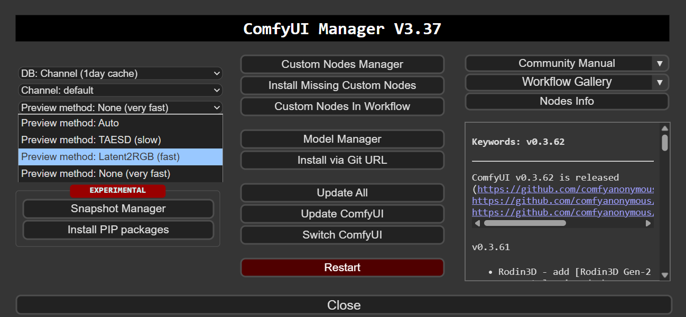
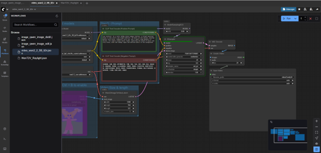
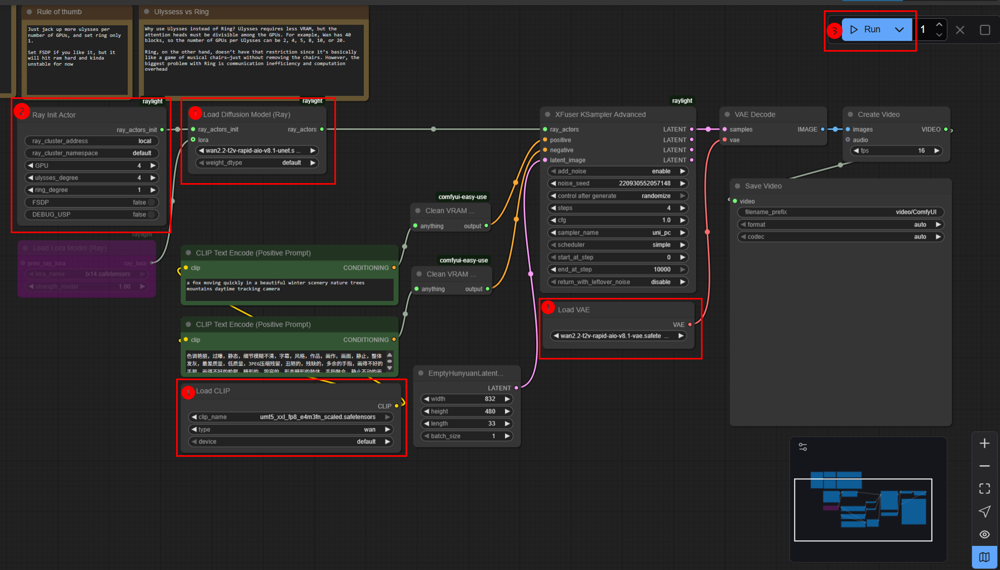
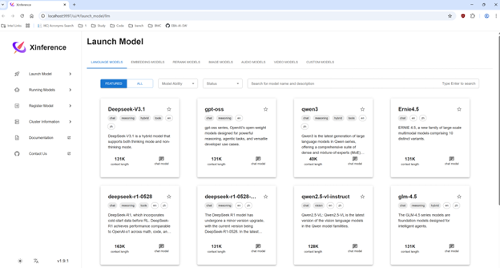
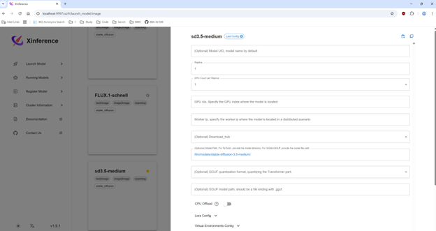
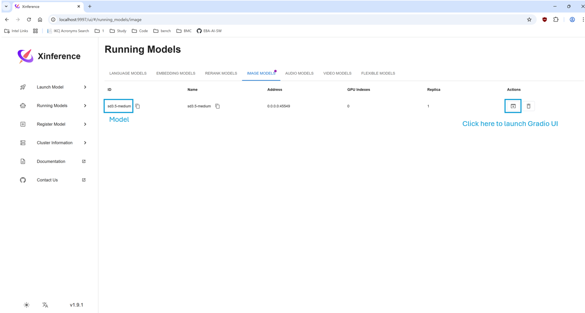
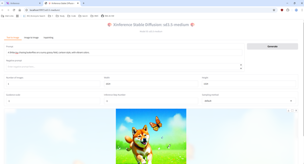

# llm-scaler-omni

---

## Table of Contents

1. [Getting Started with Omni Docker Image](#getting-started-with-omni-docker-image)
2. [ComfyUI](#comfyui)
3. [SGLang Diffusion](#sglang-diffusion-experimental)
4. [XInference](#xinference)
5. [Stand-alone Examples](#stand-alone-examples)
6. [ComfyUI for Windows (experimental)](#comfyui-for-windows-experimental)

---

## Getting Started with Omni Docker Image

Pull docker image from dockerhub:
```bash
docker pull intel/llm-scaler-omni:0.1.0-b4
```

Or build docker image:

```bash
bash build.sh
```

Run docker image:

```bash
export DOCKER_IMAGE=intel/llm-scaler-omni:0.1.0-b4
export CONTAINER_NAME=comfyui
export MODEL_DIR=<your_model_dir>
export COMFYUI_MODEL_DIR=<your_comfyui_model_dir>
sudo docker run -itd \
        --privileged \
        --net=host \
        --device=/dev/dri \
        -e no_proxy=localhost,127.0.0.1 \
        --name=$CONTAINER_NAME \
        -v $MODEL_DIR:/llm/models/ \
        -v $COMFYUI_MODEL_DIR:/llm/ComfyUI/models \
        --shm-size="64g" \
        --entrypoint=/bin/bash \
        $DOCKER_IMAGE

docker exec -it comfyui bash
```

## ComfyUI

### Starting ComfyUI

```bash
cd /llm/ComfyUI

export http_proxy=<your_proxy>
export https_proxy=<your_proxy>
export no_proxy=localhost,127.0.0.1

python3 main.py
```

Then you can access the webUI at `http://<your_local_ip>:8188/`. 

### (Optional) Preview settings for ComfyUI

Click the button on the top-right corner to launch ComfyUI Manager. 


Modify the `Preview method` to show the preview image during sampling iterations.



### Supported Models

The following models are supported in ComfyUI workflows:

| Model Category | Model Name | Type | Workflow Files |
|---------------|------------|------|----------------|
| **Image Generation** | Qwen-Image, Qwen-Image-Edit | Text-to-Image, Image Editing | `image_qwen_image.json`, `image_qwen_image_distill.json`, `image_qwen_image_edit.json`, `image_qwen_image_edit_2509.json` |
| **Image Generation** | Stable Diffusion 3.5 | Text-to-Image, ControlNet | `image_sd3.5_simple_example.json`, `image_sd3.5_midium.json`, `image_sd3.5_large_canny_controlnet_example.json` |
| **Image Generation** | Z-Image-Turbo | Text-to-Image |  `image_z_image_turbo.json` |
| **Image Generation** | Flux.1, Flux.1 Kontext dev | Text-to-Image, Multi-Image Reference, ControlNet | `image_flux_kontext_dev_basic.json`, `image_flux_controlnet_example.json` |
| **Video Generation** | Wan2.2 TI2V 5B, Wan2.2 T2V 14B, Wan2.2 I2V 14B | Text-to-Video, Image-to-Video | `video_wan2_2_5B_ti2v.json`, `video_wan2_2_14B_t2v.json`, `video_wan2_2_14B_t2v_rapid_aio_multi_xpu.json`, `video_wan2.2_14B_i2v_rapid_aio_multi_xpu.json` |
| **Video Generation** | Wan2.2 Animate 14B | Video Animation | `video_wan2_2_animate_basic.json` |
| **Video Generation** | HunyuanVideo 1.5 8.3B | Text-to-Video, Image-to-Video | `video_hunyuan_video_1.5_t2v.json`, `video_hunyuan_video_1.5_i2v.json`, `video_hunyuan_video_1.5_i2v_multi_xpu.json` |
| **3D Generation** | Hunyuan3D 2.1 | Text/Image-to-3D | `3d_hunyuan3d.json` |
| **Audio Generation** | VoxCPM | Text-to-Speech | `audio_VoxCPM_example.json` |

### ComfyUI Workflows

On the left side of the web UI, you can find the workflows logo to load and manage workflows.


All workflow files are available in the `workflows/` directory. Below are detailed descriptions of supported workflows organized by category.

#### Image Generation Workflows

##### Qwen-Image

ComfyUI tutorial: https://docs.comfy.org/tutorials/image/qwen/qwen-image

**Available Workflows:**
- **image_qwen_image.json**: Native Qwen-Image workflow for text-to-image generation
- **image_qwen_image_distill.json**: Distilled version with better performance (recommended)

> **Note:** Only the native workflow is fully validated. There are some issues using LoRA. It's recommended to use the distilled version for better performance.

##### Qwen-Image-Edit

ComfyUI tutorial: https://docs.comfy.org/tutorials/image/qwen/qwen-image-edit

**Available Workflows:**
- **image_qwen_image_edit.json**: Standard image editing workflow
- **image_qwen_image_edit_2509.json**: Updated version with enhanced features

These workflows enable image editing based on text prompts, allowing you to modify existing images.

##### Stable Diffusion 3.5

ComfyUI tutorial: https://comfyanonymous.github.io/ComfyUI_examples/sd3/

**Available Workflows:**
- **image_sd3.5_simple_example.json**: Simple text-to-image workflow
- **image_sd3.5_midium.json**: Medium model variant
- **image_sd3.5_large_canny_controlnet_example.json**: Large model with Canny edge ControlNet for precise control

Stable Diffusion 3.5 provides high-quality text-to-image generation with optional ControlNet support for guided generation.

##### Z-Image-Turbo

Comfyui tutorial: https://docs.comfy.org/tutorials/image/z-image/z-image-turbo

**Available Workflows:**
- **image_z_image_turbo.json**: Basic workflow for text-to-image generation

##### Flux.1 Kontext Dev

ComfyUI tutorial: https://docs.comfy.org/tutorials/flux/flux-1-kontext-dev

**Available Workflows:**
- **image_flux_kontext_dev_basic.json**: Basic workflow with multi-image reference support

#### Video Generation Workflows

##### Wan2.2

ComfyUI tutorial: https://docs.comfy.org/tutorials/video/wan/wan2_2

**Available Workflows:**
- **video_wan2_2_5B_ti2v.json**: Text+Image-to-Video with 5B model
- **video_wan2_2_14B_t2v.json**: Text-to-Video with 14B model
- **video_wan2_2_14B_t2v_rapid_aio_multi_xpu.json**: 14B Text-to-Video with multi-XPU support (using raylight)
- **video_wan2.2_14B_i2v_rapid_aio_multi_xpu.json**: 14B Image-to-Video with multi-XPU support

**Multi-XPU Support with Raylight:**

For workflows using [WAN2.2-14B-Rapid-AllInOne](https://huggingface.co/Phr00t/WAN2.2-14B-Rapid-AllInOne) with [raylight](https://github.com/komikndr/raylight) for faster inference with multi-XPU support:



**Steps to Complete Multi-XPU Workflows:**

1. **Model Loading**
   - Ensure the `Load Diffusion Model (Ray)` node loads the diffusion model part from WAN2.2-14B-Rapid-AllInOne
   - Ensure the `Load VAE` node loads the VAE part from WAN2.2-14B-Rapid-AllInOne
   - Ensure the `Load CLIP` node loads `umt5_xxl_fp8_e4m3fn_scaled.safetensors`

2. **Ray Configuration**
   - Set the `GPU` and `ulysses_degree` in `Ray Init Actor` node to the number of GPUs you want to use

3. **Run the Workflow**
   - Click the `Run` button or use the shortcut `Ctrl(cmd) + Enter` to run the workflow

> **Note:** Model weights can be obtained from [ModelScope](https://modelscope.cn/models/Phr00t/WAN2.2-14B-Rapid-AllInOne/files). You may need to extract the unet and VAE parts separately using `tools/extract.py`.

##### Wan2.2 Animate 14B

**Available Workflows:**
- **video_wan2_2_animate_basic.json**: Video animation workflow with control video support

This is a separate model from the standard Wan2.2 T2V/I2V models, designed specifically for video animation with control video inputs.

##### HunyuanVideo 1.5 8.3B

ComfyUI tutorial: https://docs.comfy.org/tutorials/video/hunyuan/hunyuan-video-1-5

**Available Workflows:**

- **video_hunyuan_video_1.5_t2v.json**: Basic workflow for Text-to-Video generation

- **video_hunyuan_video_1.5_i2v.json**: Basic workflow for Image-to-Video generation

- **video_hunyuan_video_1.5_i2v_multi_xpu.json**: 8.3B Image-to-Video multi-XPU support with [raylight](https://github.com/komikndr/raylight)

The default parameter configurations of these workflows are optimized for 480p FP8 Image-to-Video.

#### 3D Generation Workflows

##### Hunyuan3D

**Available Workflows:**
- **3d_hunyuan3d.json**: Text/Image-to-3D mesh generation

This workflow generates 3D models from text descriptions or images using the Hunyuan3D model.

#### Audio Generation Workflows

##### VoxCPM

**Available Workflows:**
- **audio_VoxCPM_example.json**: Text-to-Speech synthesis

This workflow generates speech audio from text input using the VoxCPM model.

##### IndexTTS 2

**Available Workflows:**
- **audio_indextts2.json**: Voice cloning

This workflow synthesizes new speech using a single reference audio file for voice cloning.

**Usage Steps:**

1. **Prepare Models**

   Download the following models and place them in the `<your comfyui model path>/TTS` directory:
   - `IndexTeam/IndexTTS-2`
   - `nvidia/bigvgan_v2_22khz_80band_256x`
   - `funasr/campplus`
   - `amphion/MaskGCT`
   - `facebook/w2v-bert-2.0`

   Ensure your file structure matches the following hierarchy:

   ```text
   TTS/
   ├── bigvgan_v2_22khz_80band_256x/
   │   ├── bigvgan_generator.pt
   │   └── config.json
   ├── campplus/
   │   └── campplus_cn_common.bin
   ├── IndexTTS-2/
   │   ├── .gitattributes
   │   ├── bpe.model
   │   ├── config.yaml
   │   ├── feat1.pt
   │   ├── feat2.pt
   │   ├── gpt.pth
   │   ├── README.md
   │   ├── s2mel.pth
   │   ├── wav2vec2bert_stats.pt
   │   └── qwen0.6bemo4-merge/
   │       ├── added_tokens.json
   │       ├── chat_template.jinja
   │       ├── config.json
   │       ├── generation_config.json
   │       ├── merges.txt
   │       ├── model.safetensors
   │       ├── Modelfile
   │       ├── special_tokens_map.json
   │       ├── tokenizer.json
   │       ├── tokenizer_config.json
   │       └── vocab.json
   ├── MaskGCT/
   │   └── semantic_codec/
   │       └── model.safetensors
   └── w2v-bert-2.0/
       ├── .gitattributes
       ├── config.json
       ├── conformer_shaw.pt
       ├── model.safetensors
       ├── preprocessor_config.json
       └── README.md
   ```

2. **Configure Workflow**
   - Load the reference audio file.
   - Set the desired input text.

3. **Run the Workflow**
   - Execute the workflow to generate the speech.

## SGLang Diffusion (experimental)

SGLang Diffusion provides OpenAI-compatible API for image/video generation models.

### 1. CLI Generation

```bash
sglang generate --model-path /llm/models/Wan2.1-T2V-1.3B-Diffusers \
    --text-encoder-cpu-offload --pin-cpu-memory \
    --prompt "A curious raccoon" \
    --save-output
```

### 2. OpenAI API Server

**Start the server:**

```bash
# Configure proxy if needed
export http_proxy=<your_http_proxy>
export https_proxy=<your_https_proxy>
export no_proxy=localhost,127.0.0.1

# Start server
sglang serve --model-path /llm/models/Z-Image-Turbo/ \
    --vae-cpu-offload --pin-cpu-memory \
    --num-gpus 1 --port 30010
```

Or use the provided script:

```bash
bash /llm/entrypoints/start_sgl_diffusion.sh
```

**cURL example:**

```bash
curl http://localhost:30010/v1/images/generations \
  -H "Content-Type: application/json" \
  -d '{
    "model": "Z-Image-Turbo",
    "prompt": "A beautiful sunset over the ocean",
    "size": "1024x1024"
  }'
```

**Python example (OpenAI SDK):**

```python
from openai import OpenAI
import base64

client = OpenAI(base_url="http://localhost:30010/v1", api_key="EMPTY")

response = client.images.generate(
    model="Z-Image-Turbo",
    prompt="A beautiful sunset over the ocean",
    size="1024x1024",
)

# Save image from base64 response
with open("output.png", "wb") as f:
    f.write(base64.b64decode(response.data[0].b64_json))
```

## XInference

```bash
xinference-local --host 0.0.0.0 --port 9997
```
Supported models:
- Stable Diffusion 3.5 Medium
- Kokoro 82M
- whisper large v3

### WebUI Usage

#### 1. Access Xinference Web UI


#### 2. Select model and configure `model_path`


#### 3. Find running model and launch Gradio UI for this model


#### 4. Generate within Gradio UI


### OpenAI API Usage

> Visit http://127.0.0.1:9997/docs to inspect the API docs.

#### 1. Launch API service
You can select model and launch service via WebUI (refer to [here](#1-access-xinference-web-ui)) or by command:

```bash
xinference-local --host 0.0.0.0 --port 9997

xinference launch --model-name sd3.5-medium --model-type image --model-path /llm/models/stable-diffusion-3.5-medium/ --gpu-idx 0
```

#### 2. Post request in OpenAI API format

For TTS model (`Kokoro 82M` for example):
```bash
curl http://localhost:9997/v1/audio/speech   -H "Content-Type: application/json"   -d '{
    "model": "Kokoro-82M",
    "input": "kokoro, hello, I am kokoro." 
  }'   --output output.wav
```

For STT models (`whisper large v3` for example):
```bash
AUDIO_FILE_PATH=<your_audio_file_path>

curl -X 'POST' \
  "http://localhost:9997/v1/audio/translations" \
  -H 'accept: application/json' \
  -F "model=whisper-large-v3" \
  -F "file=@${AUDIO_FILE_PATH}"

{"text":" Cacaro's hello, I am Cacaro."}
```

For text-to-image models (`Stable Diffusion 3.5 Medium` for example):
```bash
curl http://localhost:9997/v1/images/generations \
  -H "Content-Type: application/json" \
  -d '{
    "model": "sd3.5-medium",
    "prompt": "A Shiba Inu chasing butterflies on a sunny grassy field, cartoon style, with vibrant colors.",
    "n": 1,
    "size": "1024x1024",
    "quality": "standard",
    "response_format": "url"
  }'
```

## Stand-alone Examples 

> Notes: Stand-alone examples are excluded from `intel/llm-scaler-omni` image.

Supported models:
- Hunyuan3D 2.1
- Qwen Image
- Wan 2.1 / 2.2

## ComfyUI for Windows (experimental)

We have provided a conda-install method to use `llm-scaler-omni` version ComfyUI on Windows.

```powershell
git clone https://github.com/intel/llm-scaler.git
cd llm-scaler\omni\
.\init_conda_env.bat
```

After installation, you can enter the `ComfyUI` directory and start ComfyUI server.

```powershell
cd ComfyUI
conda activate omni_env
$env:HTTP_PROXY = <your_proxy>
$env:HTTPS_PROXY = <your_proxy>
python .\main.py --listen 0.0.0.0
```
