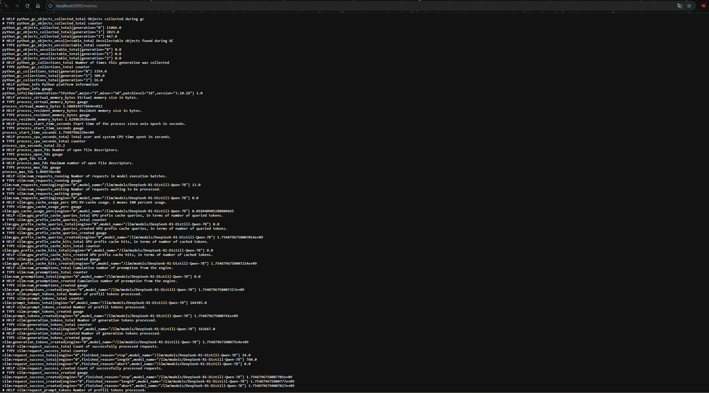
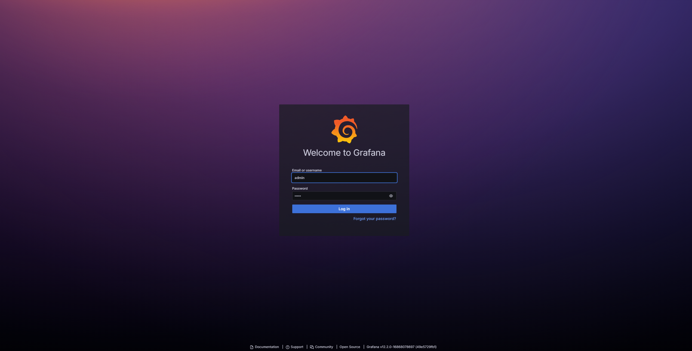
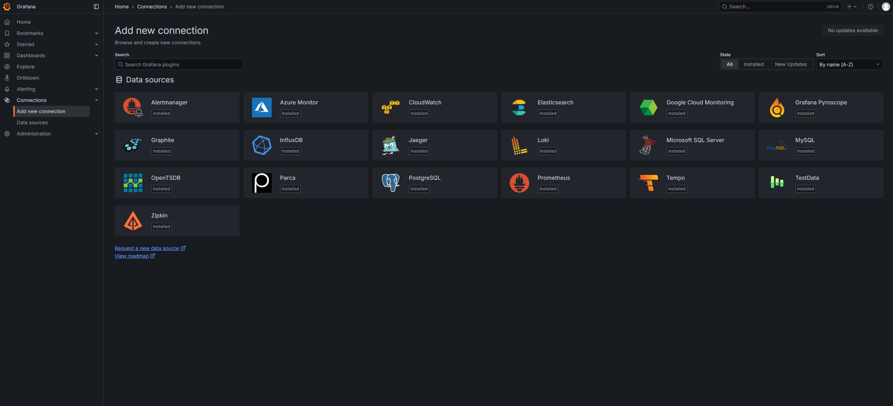
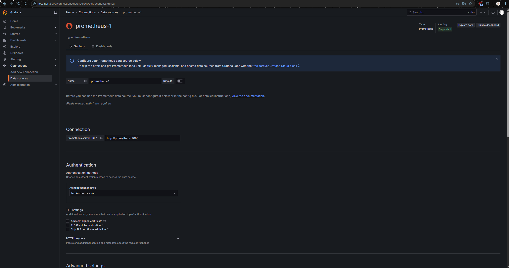
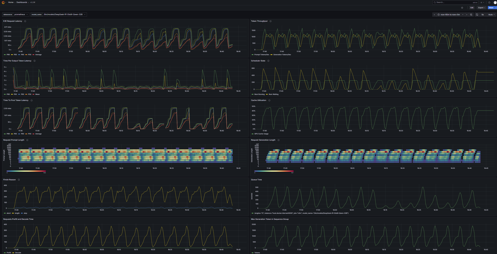

# llm-scaler-vllm

llm-scaler-vllm is an extended and optimized version of vLLM, specifically adapted for Intel’s Multi GPU platform. This project enhances vLLM’s core architecture with Intel-specific performance optimizations, advanced features, and tailored support for customer use cases.

---

## Table of Contents

1. [Getting Started and Usage](#1-getting-started-and-usage)  
   1.1 [Install Bare Metal Environment](#11-install-bare-metal-environment)  
   1.2 [Run Platform Evaluation](#12-run-platform-evaluation)  
   1.3 [Pulling and Running the vllm Docker Container](#13-pulling-and-running-the-vllm-docker-container)  
   1.4 [Launching the Serving Service](#14-launching-the-serving-service)  
   1.5 [Benchmarking the Service](#15-benchmarking-the-service)  
   1.6 [(Optional) Monitoring the Service with Prometheus and Grafana](#16-optional-monitoring-the-service-with-prometheus-and-grafana)
2. [Advanced Features](#2-advanced-features)  
   2.1 [CCL Support (both P2P & USM)](#21-ccl-support-both-p2p--usm)  
   2.2 [INT4 and FP8 Quantized Online Serving](#22-int4-and-fp8-quantized-online-serving)  
   2.3 [Embedding and Reranker Model Support](#23-embedding-and-reranker-model-support)  
   2.4 [Multi-Modal Model Support](#24-multi-modal-model-support)  
   2.5 [Omni Model Support](#25-omni-model-support)  
   2.6 [Data Parallelism (DP)](#26-data-parallelism-dp)  
   2.7 [Finding maximum Context Length](#27-finding-maximum-context-length)   
   2.8 [Multi-Modal Webui](#28-multi-modal-webui)  
   2.9 [Multi-node Distributed Deployment (PP/TP)](#29-multi-node-distributed-deployment-pptp)
4. [Supported Models](#3-supported-models)  
5. [Troubleshooting](#4-troubleshooting)
6. [Performance tuning](#5-performance-tuning)

---

## 1. Getting Started and Usage

We provide two offerings to setup the environment and run evaluation:

- Offline Installer for Bare Metal Environment Setup  
Maintained on Intel RDC website. It will include all necessary components such as Linux kernel, GPU firmware, graphics driver, tools, the update of system configuration and often used scripts without internet requirement. 
This installer can run in either bare metal or docker environments. In docker environment, it will skip the installation of Linux kernel, GPU firmware and the update of system level configuration.

- vllm Inference Docker Image (llm-scaler-vllm)  
Maintained on Dockerhub. It already uses above offline installer to align the base platform environment. Meanwhile includes the components for LLM inference such as vllm/IPEX.

Typically, users have below two use cases:

| Use Case | Description | Required Steps |
| -------- | ----------- | -------------- |
| **Platform Evaluation** | For evaluating platform capabilities only, with no intention to run vLLM inference. | 1. Install **Ubuntu 25.04** <br> 2. Download and run offline installer <br> 3. Run platform evaluation script after the installation in bare metal environment |
| **vLLM Inference Benchmark** | For running inference benchmarks based on vLLM/IPEX. | 1. Install **Ubuntu 25.04** <br> 2. Download and run offline installer  <br> 3. Pull the **vLLM Docker image** from Docker Hub <br> 4. Download the target model <br> 5. Run **vLLM-based inference performance tests** |

Currently, we include the following features for basic platform evaluation such as GPU memory bandwidth, P2P/collective communication cross GPUs and GeMM (generic matrix multiply) compute.

**Note: Both offline installer and docker image are intended for demo purposes only and not intended for production use. For production, please refer to our docker file to generate your own image**
- [vllm docker file](https://github.com/intel/llm-scaler/blob/main/vllm/docker/Dockerfile)
- [platform_docker_file](https://github.com/intel/llm-scaler/blob/main/vllm/docker/Dockerfile.platform)

### 1.1 Install Bare Metal Environment

First, install a standard Ubuntu 25.04
- [Ubuntu 25.04 Desktop](https://releases.ubuntu.com/25.04/ubuntu-25.04-desktop-amd64.iso) (for Xeon-W)
- [Ubuntu 25.04 Server](https://releases.ubuntu.com/25.04/ubuntu-25.04-live-server-amd64.iso) (for Xeon-SP).

Download Offline Installer from Intel RDC webiste. This is public but you may need register an account to download.
[RDC Download Link](https://cdrdv2.intel.com/v1/dl/getContent/865705/865702?filename=multi-arc-bmg-offline-installer-25.38.4.1.tar.xz)

Switch to root user, extract and installer and run installer script.

```bash
sudo su -
cd the_path_of_multi-arc-bmg-offline-installer-x.x.x.x 
./installer.sh
```` 

If everything is ok, you can see below installation completion message. Then please reboot to apply changes.

```bash
[INFO] Intel Multi-ARC base platform installation complete.
[INFO] Please reboot the system to apply changes.

Tools installed: gemm / 1ccl / xpu-smi in /usr/bin
level-zero-tests: ./tools/level-zero-tests
Support scripts: ./scripts
Installation log: ./install_log_20250921_191057.log
````

### 1.2 Run Platform Evaluation

After the reboot, go to /opt/intel/multi-arc directory, tools/scripts are there.

```bash
root@edgeaihost15:/home/edgeai/james/multi-arc-bmg-offline-installer-25.38.4.1# ls -l
total 80
drwxr-xr-x 4 edgeai edgeai  4096 Sep  5 18:32 base
drwxr-xr-x 2 edgeai edgeai  4096 Sep 20 17:15 firmware
drwxr-xr-x 6 edgeai edgeai  4096 Aug 28 05:46 gfxdrv
-rwxr-xr-x 1 edgeai edgeai  6668 Sep  5 18:32 installer.sh
-rw-r--r-- 1 root   root   28674 Sep 21 19:11 install_log_20250921_191057.log
drwxr-xr-x 2 edgeai edgeai  4096 Aug 28 06:05 kernel
drwxr-xr-x 2 edgeai edgeai  4096 Sep 20 17:14 oneapi
-rw-r--r-- 1 edgeai edgeai   818 Sep  1 18:11 README.md
drwxr-xr-x 4 edgeai edgeai  4096 Sep 21 19:23 results
drwxr-xr-x 7 edgeai edgeai  4096 Aug 28 06:25 scripts
drwxr-xr-x 6 edgeai edgeai  4096 Sep 20 17:14 tools
-rw-r--r-- 1 edgeai edgeai    94 Sep  1 18:10 VERSION
````

Please read the README.md firstly to understand all of our offerings. Then your may use scripts/evaluation/platform_basic_evaluation.sh
to perform a quick evaluation with report under results. We also provide a reference perf under results/

```bash
root@edgeaihost15:/home/edgeai/james/multi-arc-bmg-offline-installer-25.38.4.1# ls results/ -la
total 12
drwxr-xr-x  2 edgeai edgeai 4096 Sep 21 20:18 .
drwxr-xr-x 10 edgeai edgeai 4096 Sep 21 20:17 ..
-rw-r--r--  1 edgeai edgeai  550 Sep 20 17:46 reference_perf.csv
````

When you meet issue requiring our support, you can use below script to get necesary information of your system.
```bash
root@edgeaihost15:/home/edgeai/james/multi-arc-bmg-offline-installer-25.38.4.1# ls scripts/debug/collect_sysinfo.sh
scripts/debug/collect_sysinfo.sh
````

You can also check our FAQ and known issues for more details.
```bash
https://github.com/intel/llm-scaler/blob/main/vllm/FAQ.md
https://github.com/intel/llm-scaler/blob/main/vllm/KNOWN_ISSUES.md
````

### 1.3 Pulling and Running the vllm Docker Container

First, pull the image for **Intel Arc B60 GPUs**:

```bash
docker pull intel/llm-scaler-vllm:latest
```
**Notes:**
* `intel/llm-scaler-vllm:1.0` → PV release image
* `intel/llm-scaler-vllm:latest` → Latest development version

**Supplement: For Intel Arc A770 GPUs**
```bash
docker pull intelanalytics/multi-arc-serving:latest
```
- Usage Instructions: [VLLM Docker Quickstart for A770](https://github.com/intel/ipex-llm/blob/main/docs/mddocs/DockerGuides/vllm_docker_quickstart.md#3-start-the-docker-container)

Then, run the container:

```bash
sudo docker run -td \
    --privileged \
    --net=host \
    --device=/dev/dri \
    --name=lsv-container \
    -v /home/intel/LLM:/llm/models/ \
    -e no_proxy=localhost,127.0.0.1 \
    -e http_proxy=$http_proxy \
    -e https_proxy=$https_proxy \
    --shm-size="32g" \
    --entrypoint /bin/bash \
    intel/llm-scaler-vllm:latest
```

Enter the container:

```bash
docker exec -it lsv-container bash
```

---

**Note — Mapping a Single GPU**
> If you need to map only a specific GPU into the container, remove both `--privileged` and `--device=/dev/dri` from the `docker run` command, and replace them with the following device and mount options (example for the first GPU):

```bash
--device /dev/dri/renderD128:/dev/dri/renderD128 \
--mount type=bind,source="/dev/dri/by-path/pci-0000:18:00.0-card",target="/dev/dri/by-path/pci-0000:18:00.0-card" \
--mount type=bind,source="/dev/dri/by-path/pci-0000:18:00.0-render",target="/dev/dri/by-path/pci-0000:18:00.0-render" \
-v /dev/dri/card0:/dev/dri/card0 \
```

This way, only the first GPU will be mapped into the Docker container.

---

**Note — Intel oneAPI Environment**
> How you start the container determines whether you need to manually source the Intel oneAPI environment (`source /opt/intel/oneapi/setvars.sh --force`):
>
> * **Interactive shell (`docker exec -it <container> bash`)**  
>   `/root/.bashrc` already sources the oneAPI environment. No manual action needed.
>
> * **Docker Compose, overridden ENTRYPOINT, or direct `docker run` without interactive bash**  
>   The environment is **not automatically loaded** if no shell is involved. Prepend your command with `source /opt/intel/oneapi/setvars.sh --force &&` to ensure proper GPU/XPU setup.
>   
>   ```yaml
>   entrypoint: >
>     entrypoint: source /opt/intel/oneapi/setvars.sh --force && python3 -m vllm.entrypoints.openai.api_server --model /llm/models/Qwen3-14B
>   ```
>
> **Summary:** Automated starts require sourcing the oneAPI script; interactive bash sessions are ready to use.

---


### 1.4 Launching the Serving Service

```bash
VLLM_ALLOW_LONG_MAX_MODEL_LEN=1 \
VLLM_WORKER_MULTIPROC_METHOD=spawn \
python3 -m vllm.entrypoints.openai.api_server \
    --model /llm/models/DeepSeek-R1-Distill-Qwen-7B \
    --served-model-name DeepSeek-R1-Distill-Qwen-7B \
    --dtype=float16 \
    --enforce-eager \
    --port 8000 \
    --host 0.0.0.0 \
    --trust-remote-code \
    --disable-sliding-window \
    --gpu-memory-util=0.9 \
    --no-enable-prefix-caching \
    --max-num-batched-tokens=8192 \
    --disable-log-requests \
    --max-model-len=8192 \
    --block-size 64 \
    --quantization fp8 \
    -tp=1
```
you can add the argument `--api-key xxx` for user authentication. Users are supposed to send their requests with request header bearing the API key.

---

### 1.5 Benchmarking the Service

```bash
python3 /llm/vllm/benchmarks/benchmark_serving.py \
    --model /llm/models/DeepSeek-R1-Distill-Qwen-7B \
    --dataset-name random \
    --served-model-name DeepSeek-R1-Distill-Qwen-7B \
    --random-input-len=1024 \
    --random-output-len=512 \
    --ignore-eos \
    --num-prompt 10 \
    --trust_remote_code \
    --request-rate inf \
    --backend vllm \
    --port=8000
```
### 1.6 (Optional) Monitoring the Service with Prometheus and Grafana
create a directory and enter it
``` 
mkdir PG 
cd ./PG
```
create .yaml file for docker build
```
vim docker-compose.yaml
```

```
# docker-compose.yaml
version: "3"
services:
  prometheus:
    image: prom/prometheus:latest
    extra_hosts:
      - "host.docker.internal:host-gateway"     # allow a direct connection from container to the local machine
    ports:
      - "9090:9090"   # the default port used by Prometheus
    volumes:
      - ${PWD}/prometheus.yaml:/etc/prometheus/prometheus.yml # mount Prometheus config file
  grafana:
    image: grafana/grafana:latest
    depends_on:
      - prometheus
    ports:
      - "3000:3000" # the default port used by Grafana
```

```
vim prometheus.yaml
```

```
# prometheus.yaml
global:
  scrape_interval: 5s
  evaluation_interval: 30s

scrape_configs:
  - job_name: vllm
    static_configs:
      - targets:
          - 'host.docker.internal:8000'
```
run `docker compose up` in the directory

Access http://localhost:8000/metrics to check preprocessed vLLM Prometheus metrics.




To visualize the metrics, access http://localhost:3000 and log in to the website with default credential(`username:admin`, `password:admin`).



Access http://localhost:3000/connections/datasources/new and select the Prometheus data source to add.



On the `Prometheus` configuration page, you need to add the Prometheus Server URL in the Connection section. In this example setup, Grafana and Prometheus are running in separate containers, but Docker creates a DNS name for each container. You can directly use http://prometheus:9090.



Click Save & Test. You will see a green success message stating:
"Successfully queried the Prometheus API."

Go to http://localhost:3000/dashboard/import, upload the `grafana.json` file, and select the `prometheus` datasource. You will see an interface similar to the following:

<details><summary> grafana.json </summary>

```
    {
    "annotations": {
        "list": [
        {
            "builtIn": 1,
            "datasource": {
            "type": "grafana",
            "uid": "-- Grafana --"
            },
            "enable": true,
            "hide": true,
            "iconColor": "rgba(0, 211, 255, 1)",
            "name": "Annotations & Alerts",
            "target": {
            "limit": 100,
            "matchAny": false,
            "tags": [],
            "type": "dashboard"
            },
            "type": "dashboard"
        }
        ]
    },
    "description": "Monitoring vLLM Inference Server",
    "editable": true,
    "fiscalYearStartMonth": 0,
    "graphTooltip": 0,
    "id": 1,
    "links": [],
    "liveNow": false,
    "panels": [
        {
        "datasource": {
            "type": "prometheus",
            "uid": "${DS_PROMETHEUS}"
        },
        "description": "End to end request latency measured in seconds.",
        "fieldConfig": {
            "defaults": {
            "color": {
                "mode": "palette-classic"
            },
            "custom": {
                "axisBorderShow": false,
                "axisCenteredZero": false,
                "axisColorMode": "text",
                "axisLabel": "",
                "axisPlacement": "auto",
                "barAlignment": 0,
                "barWidthFactor": 0.6,
                "drawStyle": "line",
                "fillOpacity": 0,
                "gradientMode": "none",
                "hideFrom": {
                "legend": false,
                "tooltip": false,
                "viz": false
                },
                "insertNulls": false,
                "lineInterpolation": "linear",
                "lineWidth": 1,
                "pointSize": 5,
                "scaleDistribution": {
                "type": "linear"
                },
                "showPoints": "auto",
                "spanNulls": false,
                "stacking": {
                "group": "A",
                "mode": "none"
                },
                "thresholdsStyle": {
                "mode": "off"
                }
            },
            "mappings": [],
            "thresholds": {
                "mode": "absolute",
                "steps": [
                {
                    "color": "green",
                    "value": null
                },
                {
                    "color": "red",
                    "value": 80
                }
                ]
            },
            "unit": "s"
            },
            "overrides": []
        },
        "gridPos": {
            "h": 8,
            "w": 12,
            "x": 0,
            "y": 0
        },
        "id": 9,
        "options": {
            "legend": {
            "calcs": [],
            "displayMode": "list",
            "placement": "bottom",
            "showLegend": true
            },
            "tooltip": {
            "mode": "single",
            "sort": "none"
            }
        },
        "targets": [
            {
            "datasource": {
                "type": "prometheus",
                "uid": "${DS_PROMETHEUS}"
            },
            "disableTextWrap": false,
            "editorMode": "builder",
            "expr": "histogram_quantile(0.99, sum by(le) (rate(vllm:e2e_request_latency_seconds_bucket{model_name=\"$model_name\"}[$__rate_interval])))",
            "fullMetaSearch": false,
            "includeNullMetadata": false,
            "instant": false,
            "legendFormat": "P99",
            "range": true,
            "refId": "A",
            "useBackend": false
            },
            {
            "datasource": {
                "type": "prometheus",
                "uid": "${DS_PROMETHEUS}"
            },
            "disableTextWrap": false,
            "editorMode": "builder",
            "expr": "histogram_quantile(0.95, sum by(le) (rate(vllm:e2e_request_latency_seconds_bucket{model_name=\"$model_name\"}[$__rate_interval])))",
            "fullMetaSearch": false,
            "hide": false,
            "includeNullMetadata": false,
            "instant": false,
            "legendFormat": "P95",
            "range": true,
            "refId": "B",
            "useBackend": false
            },
            {
            "datasource": {
                "type": "prometheus",
                "uid": "${DS_PROMETHEUS}"
            },
            "disableTextWrap": false,
            "editorMode": "builder",
            "expr": "histogram_quantile(0.9, sum by(le) (rate(vllm:e2e_request_latency_seconds_bucket{model_name=\"$model_name\"}[$__rate_interval])))",
            "fullMetaSearch": false,
            "hide": false,
            "includeNullMetadata": false,
            "instant": false,
            "legendFormat": "P90",
            "range": true,
            "refId": "C",
            "useBackend": false
            },
            {
            "datasource": {
                "type": "prometheus",
                "uid": "${DS_PROMETHEUS}"
            },
            "disableTextWrap": false,
            "editorMode": "builder",
            "expr": "histogram_quantile(0.5, sum by(le) (rate(vllm:e2e_request_latency_seconds_bucket{model_name=\"$model_name\"}[$__rate_interval])))",
            "fullMetaSearch": false,
            "hide": false,
            "includeNullMetadata": false,
            "instant": false,
            "legendFormat": "P50",
            "range": true,
            "refId": "D",
            "useBackend": false
            },
            {
            "datasource": {
                "type": "prometheus",
                "uid": "${DS_PROMETHEUS}"
            },
            "editorMode": "code",
            "expr": "rate(vllm:e2e_request_latency_seconds_sum{model_name=\"$model_name\"}[$__rate_interval])\n/\nrate(vllm:e2e_request_latency_seconds_count{model_name=\"$model_name\"}[$__rate_interval])",
            "hide": false,
            "instant": false,
            "legendFormat": "Average",
            "range": true,
            "refId": "E"
            }
        ],
        "title": "E2E Request Latency",
        "type": "timeseries"
        },
        {
        "datasource": {
            "type": "prometheus",
            "uid": "${DS_PROMETHEUS}"
        },
        "description": "Number of tokens processed per second",
        "fieldConfig": {
            "defaults": {
            "color": {
                "mode": "palette-classic"
            },
            "custom": {
                "axisBorderShow": false,
                "axisCenteredZero": false,
                "axisColorMode": "text",
                "axisLabel": "",
                "axisPlacement": "auto",
                "barAlignment": 0,
                "barWidthFactor": 0.6,
                "drawStyle": "line",
                "fillOpacity": 0,
                "gradientMode": "none",
                "hideFrom": {
                "legend": false,
                "tooltip": false,
                "viz": false
                },
                "insertNulls": false,
                "lineInterpolation": "linear",
                "lineWidth": 1,
                "pointSize": 5,
                "scaleDistribution": {
                "type": "linear"
                },
                "showPoints": "auto",
                "spanNulls": false,
                "stacking": {
                "group": "A",
                "mode": "none"
                },
                "thresholdsStyle": {
                "mode": "off"
                }
            },
            "mappings": [],
            "thresholds": {
                "mode": "absolute",
                "steps": [
                {
                    "color": "green",
                    "value": null
                },
                {
                    "color": "red",
                    "value": 80
                }
                ]
            }
            },
            "overrides": []
        },
        "gridPos": {
            "h": 8,
            "w": 12,
            "x": 12,
            "y": 0
        },
        "id": 8,
        "options": {
            "legend": {
            "calcs": [],
            "displayMode": "list",
            "placement": "bottom",
            "showLegend": true
            },
            "tooltip": {
            "mode": "single",
            "sort": "none"
            }
        },
        "targets": [
            {
            "datasource": {
                "type": "prometheus",
                "uid": "${DS_PROMETHEUS}"
            },
            "disableTextWrap": false,
            "editorMode": "builder",
            "expr": "rate(vllm:prompt_tokens_total{model_name=\"$model_name\"}[$__rate_interval])",
            "fullMetaSearch": false,
            "includeNullMetadata": false,
            "instant": false,
            "legendFormat": "Prompt Tokens/Sec",
            "range": true,
            "refId": "A",
            "useBackend": false
            },
            {
            "datasource": {
                "type": "prometheus",
                "uid": "${DS_PROMETHEUS}"
            },
            "disableTextWrap": false,
            "editorMode": "builder",
            "expr": "rate(vllm:generation_tokens_total{model_name=\"$model_name\"}[$__rate_interval])",
            "fullMetaSearch": false,
            "hide": false,
            "includeNullMetadata": false,
            "instant": false,
            "legendFormat": "Generation Tokens/Sec",
            "range": true,
            "refId": "B",
            "useBackend": false
            }
        ],
        "title": "Token Throughput",
        "type": "timeseries"
        },
        {
        "datasource": {
            "type": "prometheus",
            "uid": "${DS_PROMETHEUS}"
        },
        "description": "Inter token latency in seconds.",
        "fieldConfig": {
            "defaults": {
            "color": {
                "mode": "palette-classic"
            },
            "custom": {
                "axisBorderShow": false,
                "axisCenteredZero": false,
                "axisColorMode": "text",
                "axisLabel": "",
                "axisPlacement": "auto",
                "barAlignment": 0,
                "barWidthFactor": 0.6,
                "drawStyle": "line",
                "fillOpacity": 0,
                "gradientMode": "none",
                "hideFrom": {
                "legend": false,
                "tooltip": false,
                "viz": false
                },
                "insertNulls": false,
                "lineInterpolation": "linear",
                "lineWidth": 1,
                "pointSize": 5,
                "scaleDistribution": {
                "type": "linear"
                },
                "showPoints": "auto",
                "spanNulls": false,
                "stacking": {
                "group": "A",
                "mode": "none"
                },
                "thresholdsStyle": {
                "mode": "off"
                }
            },
            "mappings": [],
            "thresholds": {
                "mode": "absolute",
                "steps": [
                {
                    "color": "green",
                    "value": null
                },
                {
                    "color": "red",
                    "value": 80
                }
                ]
            },
            "unit": "s"
            },
            "overrides": []
        },
        "gridPos": {
            "h": 8,
            "w": 12,
            "x": 0,
            "y": 8
        },
        "id": 10,
        "options": {
            "legend": {
            "calcs": [],
            "displayMode": "list",
            "placement": "bottom",
            "showLegend": true
            },
            "tooltip": {
            "mode": "single",
            "sort": "none"
            }
        },
        "targets": [
            {
            "datasource": {
                "type": "prometheus",
                "uid": "${DS_PROMETHEUS}"
            },
            "disableTextWrap": false,
            "editorMode": "builder",
            "expr": "histogram_quantile(0.99, sum by(le) (rate(vllm:time_per_output_token_seconds_bucket{model_name=\"$model_name\"}[$__rate_interval])))",
            "fullMetaSearch": false,
            "includeNullMetadata": false,
            "instant": false,
            "legendFormat": "P99",
            "range": true,
            "refId": "A",
            "useBackend": false
            },
            {
            "datasource": {
                "type": "prometheus",
                "uid": "${DS_PROMETHEUS}"
            },
            "disableTextWrap": false,
            "editorMode": "builder",
            "expr": "histogram_quantile(0.95, sum by(le) (rate(vllm:time_per_output_token_seconds_bucket{model_name=\"$model_name\"}[$__rate_interval])))",
            "fullMetaSearch": false,
            "hide": false,
            "includeNullMetadata": false,
            "instant": false,
            "legendFormat": "P95",
            "range": true,
            "refId": "B",
            "useBackend": false
            },
            {
            "datasource": {
                "type": "prometheus",
                "uid": "${DS_PROMETHEUS}"
            },
            "disableTextWrap": false,
            "editorMode": "builder",
            "expr": "histogram_quantile(0.9, sum by(le) (rate(vllm:time_per_output_token_seconds_bucket{model_name=\"$model_name\"}[$__rate_interval])))",
            "fullMetaSearch": false,
            "hide": false,
            "includeNullMetadata": false,
            "instant": false,
            "legendFormat": "P90",
            "range": true,
            "refId": "C",
            "useBackend": false
            },
            {
            "datasource": {
                "type": "prometheus",
                "uid": "${DS_PROMETHEUS}"
            },
            "disableTextWrap": false,
            "editorMode": "builder",
            "expr": "histogram_quantile(0.5, sum by(le) (rate(vllm:time_per_output_token_seconds_bucket{model_name=\"$model_name\"}[$__rate_interval])))",
            "fullMetaSearch": false,
            "hide": false,
            "includeNullMetadata": false,
            "instant": false,
            "legendFormat": "P50",
            "range": true,
            "refId": "D",
            "useBackend": false
            },
            {
            "datasource": {
                "type": "prometheus",
                "uid": "${DS_PROMETHEUS}"
            },
            "editorMode": "code",
            "expr": "rate(vllm:time_per_output_token_seconds_sum{model_name=\"$model_name\"}[$__rate_interval])\n/\nrate(vllm:time_per_output_token_seconds_count{model_name=\"$model_name\"}[$__rate_interval])",
            "hide": false,
            "instant": false,
            "legendFormat": "Mean",
            "range": true,
            "refId": "E"
            }
        ],
        "title": "Time Per Output Token Latency",
        "type": "timeseries"
        },
        {
        "datasource": {
            "type": "prometheus",
            "uid": "${DS_PROMETHEUS}"
        },
        "description": "Number of requests in RUNNING, WAITING, and SWAPPED state",
        "fieldConfig": {
            "defaults": {
            "color": {
                "mode": "palette-classic"
            },
            "custom": {
                "axisBorderShow": false,
                "axisCenteredZero": false,
                "axisColorMode": "text",
                "axisLabel": "",
                "axisPlacement": "auto",
                "barAlignment": 0,
                "barWidthFactor": 0.6,
                "drawStyle": "line",
                "fillOpacity": 0,
                "gradientMode": "none",
                "hideFrom": {
                "legend": false,
                "tooltip": false,
                "viz": false
                },
                "insertNulls": false,
                "lineInterpolation": "linear",
                "lineWidth": 1,
                "pointSize": 5,
                "scaleDistribution": {
                "type": "linear"
                },
                "showPoints": "auto",
                "spanNulls": false,
                "stacking": {
                "group": "A",
                "mode": "none"
                },
                "thresholdsStyle": {
                "mode": "off"
                }
            },
            "mappings": [],
            "thresholds": {
                "mode": "absolute",
                "steps": [
                {
                    "color": "green",
                    "value": null
                },
                {
                    "color": "red",
                    "value": 80
                }
                ]
            },
            "unit": "none"
            },
            "overrides": []
        },
        "gridPos": {
            "h": 8,
            "w": 12,
            "x": 12,
            "y": 8
        },
        "id": 3,
        "options": {
            "legend": {
            "calcs": [],
            "displayMode": "list",
            "placement": "bottom",
            "showLegend": true
            },
            "tooltip": {
            "mode": "single",
            "sort": "none"
            }
        },
        "targets": [
            {
            "datasource": {
                "type": "prometheus",
                "uid": "${DS_PROMETHEUS}"
            },
            "disableTextWrap": false,
            "editorMode": "builder",
            "expr": "vllm:num_requests_running{model_name=\"$model_name\"}",
            "fullMetaSearch": false,
            "includeNullMetadata": true,
            "instant": false,
            "legendFormat": "Num Running",
            "range": true,
            "refId": "A",
            "useBackend": false
            },
            {
            "datasource": {
                "type": "prometheus",
                "uid": "${DS_PROMETHEUS}"
            },
            "disableTextWrap": false,
            "editorMode": "builder",
            "expr": "vllm:num_requests_swapped{model_name=\"$model_name\"}",
            "fullMetaSearch": false,
            "hide": false,
            "includeNullMetadata": true,
            "instant": false,
            "legendFormat": "Num Swapped",
            "range": true,
            "refId": "B",
            "useBackend": false
            },
            {
            "datasource": {
                "type": "prometheus",
                "uid": "${DS_PROMETHEUS}"
            },
            "disableTextWrap": false,
            "editorMode": "builder",
            "expr": "vllm:num_requests_waiting{model_name=\"$model_name\"}",
            "fullMetaSearch": false,
            "hide": false,
            "includeNullMetadata": true,
            "instant": false,
            "legendFormat": "Num Waiting",
            "range": true,
            "refId": "C",
            "useBackend": false
            }
        ],
        "title": "Scheduler State",
        "type": "timeseries"
        },
        {
        "datasource": {
            "type": "prometheus",
            "uid": "${DS_PROMETHEUS}"
        },
        "description": "P50, P90, P95, and P99 TTFT latency in seconds.",
        "fieldConfig": {
            "defaults": {
            "color": {
                "mode": "palette-classic"
            },
            "custom": {
                "axisBorderShow": false,
                "axisCenteredZero": false,
                "axisColorMode": "text",
                "axisLabel": "",
                "axisPlacement": "auto",
                "barAlignment": 0,
                "barWidthFactor": 0.6,
                "drawStyle": "line",
                "fillOpacity": 0,
                "gradientMode": "none",
                "hideFrom": {
                "legend": false,
                "tooltip": false,
                "viz": false
                },
                "insertNulls": false,
                "lineInterpolation": "linear",
                "lineWidth": 1,
                "pointSize": 5,
                "scaleDistribution": {
                "type": "linear"
                },
                "showPoints": "auto",
                "spanNulls": false,
                "stacking": {
                "group": "A",
                "mode": "none"
                },
                "thresholdsStyle": {
                "mode": "off"
                }
            },
            "mappings": [],
            "thresholds": {
                "mode": "absolute",
                "steps": [
                {
                    "color": "green",
                    "value": null
                },
                {
                    "color": "red",
                    "value": 80
                }
                ]
            },
            "unit": "s"
            },
            "overrides": []
        },
        "gridPos": {
            "h": 8,
            "w": 12,
            "x": 0,
            "y": 16
        },
        "id": 5,
        "options": {
            "legend": {
            "calcs": [],
            "displayMode": "list",
            "placement": "bottom",
            "showLegend": true
            },
            "tooltip": {
            "mode": "single",
            "sort": "none"
            }
        },
        "targets": [
            {
            "datasource": {
                "type": "prometheus",
                "uid": "${DS_PROMETHEUS}"
            },
            "disableTextWrap": false,
            "editorMode": "builder",
            "expr": "histogram_quantile(0.99, sum by(le) (rate(vllm:time_to_first_token_seconds_bucket{model_name=\"$model_name\"}[$__rate_interval])))",
            "fullMetaSearch": false,
            "hide": false,
            "includeNullMetadata": false,
            "instant": false,
            "legendFormat": "P99",
            "range": true,
            "refId": "A",
            "useBackend": false
            },
            {
            "datasource": {
                "type": "prometheus",
                "uid": "${DS_PROMETHEUS}"
            },
            "disableTextWrap": false,
            "editorMode": "builder",
            "expr": "histogram_quantile(0.95, sum by(le) (rate(vllm:time_to_first_token_seconds_bucket{model_name=\"$model_name\"}[$__rate_interval])))",
            "fullMetaSearch": false,
            "includeNullMetadata": false,
            "instant": false,
            "legendFormat": "P95",
            "range": true,
            "refId": "B",
            "useBackend": false
            },
            {
            "datasource": {
                "type": "prometheus",
                "uid": "${DS_PROMETHEUS}"
            },
            "disableTextWrap": false,
            "editorMode": "builder",
            "expr": "histogram_quantile(0.9, sum by(le) (rate(vllm:time_to_first_token_seconds_bucket{model_name=\"$model_name\"}[$__rate_interval])))",
            "fullMetaSearch": false,
            "hide": false,
            "includeNullMetadata": false,
            "instant": false,
            "legendFormat": "P90",
            "range": true,
            "refId": "C",
            "useBackend": false
            },
            {
            "datasource": {
                "type": "prometheus",
                "uid": "${DS_PROMETHEUS}"
            },
            "disableTextWrap": false,
            "editorMode": "builder",
            "expr": "histogram_quantile(0.5, sum by(le) (rate(vllm:time_to_first_token_seconds_bucket{model_name=\"$model_name\"}[$__rate_interval])))",
            "fullMetaSearch": false,
            "hide": false,
            "includeNullMetadata": false,
            "instant": false,
            "legendFormat": "P50",
            "range": true,
            "refId": "D",
            "useBackend": false
            },
            {
            "datasource": {
                "type": "prometheus",
                "uid": "${DS_PROMETHEUS}"
            },
            "editorMode": "code",
            "expr": "rate(vllm:time_to_first_token_seconds_sum{model_name=\"$model_name\"}[$__rate_interval])\n/\nrate(vllm:time_to_first_token_seconds_count{model_name=\"$model_name\"}[$__rate_interval])",
            "hide": false,
            "instant": false,
            "legendFormat": "Average",
            "range": true,
            "refId": "E"
            }
        ],
        "title": "Time To First Token Latency",
        "type": "timeseries"
        },
        {
        "datasource": {
            "type": "prometheus",
            "uid": "${DS_PROMETHEUS}"
        },
        "description": "Percentage of used cache blocks by vLLM.",
        "fieldConfig": {
            "defaults": {
            "color": {
                "mode": "palette-classic"
            },
            "custom": {
                "axisBorderShow": false,
                "axisCenteredZero": false,
                "axisColorMode": "text",
                "axisLabel": "",
                "axisPlacement": "auto",
                "barAlignment": 0,
                "barWidthFactor": 0.6,
                "drawStyle": "line",
                "fillOpacity": 0,
                "gradientMode": "none",
                "hideFrom": {
                "legend": false,
                "tooltip": false,
                "viz": false
                },
                "insertNulls": false,
                "lineInterpolation": "linear",
                "lineWidth": 1,
                "pointSize": 5,
                "scaleDistribution": {
                "type": "linear"
                },
                "showPoints": "auto",
                "spanNulls": false,
                "stacking": {
                "group": "A",
                "mode": "none"
                },
                "thresholdsStyle": {
                "mode": "off"
                }
            },
            "mappings": [],
            "thresholds": {
                "mode": "absolute",
                "steps": [
                {
                    "color": "green",
                    "value": null
                },
                {
                    "color": "red",
                    "value": 80
                }
                ]
            },
            "unit": "percentunit"
            },
            "overrides": []
        },
        "gridPos": {
            "h": 8,
            "w": 12,
            "x": 12,
            "y": 16
        },
        "id": 4,
        "options": {
            "legend": {
            "calcs": [],
            "displayMode": "list",
            "placement": "bottom",
            "showLegend": true
            },
            "tooltip": {
            "mode": "single",
            "sort": "none"
            }
        },
        "targets": [
            {
            "datasource": {
                "type": "prometheus",
                "uid": "${DS_PROMETHEUS}"
            },
            "editorMode": "code",
            "expr": "vllm:gpu_cache_usage_perc{model_name=\"$model_name\"}",
            "instant": false,
            "legendFormat": "GPU Cache Usage",
            "range": true,
            "refId": "A"
            },
            {
            "datasource": {
                "type": "prometheus",
                "uid": "${DS_PROMETHEUS}"
            },
            "editorMode": "code",
            "expr": "vllm:cpu_cache_usage_perc{model_name=\"$model_name\"}",
            "hide": false,
            "instant": false,
            "legendFormat": "CPU Cache Usage",
            "range": true,
            "refId": "B"
            }
        ],
        "title": "Cache Utilization",
        "type": "timeseries"
        },
        {
        "datasource": {
            "type": "prometheus",
            "uid": "${DS_PROMETHEUS}"
        },
        "description": "Heatmap of request prompt length",
        "fieldConfig": {
            "defaults": {
            "custom": {
                "hideFrom": {
                "legend": false,
                "tooltip": false,
                "viz": false
                },
                "scaleDistribution": {
                "type": "linear"
                }
            }
            },
            "overrides": []
        },
        "gridPos": {
            "h": 8,
            "w": 12,
            "x": 0,
            "y": 24
        },
        "id": 12,
        "options": {
            "calculate": false,
            "cellGap": 1,
            "cellValues": {
            "unit": "none"
            },
            "color": {
            "exponent": 0.5,
            "fill": "dark-orange",
            "min": 0,
            "mode": "scheme",
            "reverse": false,
            "scale": "exponential",
            "scheme": "Spectral",
            "steps": 64
            },
            "exemplars": {
            "color": "rgba(255,0,255,0.7)"
            },
            "filterValues": {
            "le": 1e-9
            },
            "legend": {
            "show": true
            },
            "rowsFrame": {
            "layout": "auto",
            "value": "Request count"
            },
            "tooltip": {
            "mode": "single",
            "showColorScale": false,
            "yHistogram": true
            },
            "yAxis": {
            "axisLabel": "Prompt Length",
            "axisPlacement": "left",
            "reverse": false,
            "unit": "none"
            }
        },
        "pluginVersion": "11.2.0",
        "targets": [
            {
            "datasource": {
                "type": "prometheus",
                "uid": "${DS_PROMETHEUS}"
            },
            "disableTextWrap": false,
            "editorMode": "builder",
            "expr": "sum by(le) (increase(vllm:request_prompt_tokens_bucket{model_name=\"$model_name\"}[$__rate_interval]))",
            "format": "heatmap",
            "fullMetaSearch": false,
            "includeNullMetadata": true,
            "instant": false,
            "legendFormat": "{{le}}",
            "range": true,
            "refId": "A",
            "useBackend": false
            }
        ],
        "title": "Request Prompt Length",
        "type": "heatmap"
        },
        {
        "datasource": {
            "type": "prometheus",
            "uid": "${DS_PROMETHEUS}"
        },
        "description": "Heatmap of request generation length",
        "fieldConfig": {
            "defaults": {
            "custom": {
                "hideFrom": {
                "legend": false,
                "tooltip": false,
                "viz": false
                },
                "scaleDistribution": {
                "type": "linear"
                }
            }
            },
            "overrides": []
        },
        "gridPos": {
            "h": 8,
            "w": 12,
            "x": 12,
            "y": 24
        },
        "id": 13,
        "options": {
            "calculate": false,
            "cellGap": 1,
            "cellValues": {
            "unit": "none"
            },
            "color": {
            "exponent": 0.5,
            "fill": "dark-orange",
            "min": 0,
            "mode": "scheme",
            "reverse": false,
            "scale": "exponential",
            "scheme": "Spectral",
            "steps": 64
            },
            "exemplars": {
            "color": "rgba(255,0,255,0.7)"
            },
            "filterValues": {
            "le": 1e-9
            },
            "legend": {
            "show": true
            },
            "rowsFrame": {
            "layout": "auto",
            "value": "Request count"
            },
            "tooltip": {
            "mode": "single",
            "showColorScale": false,
            "yHistogram": true
            },
            "yAxis": {
            "axisLabel": "Generation Length",
            "axisPlacement": "left",
            "reverse": false,
            "unit": "none"
            }
        },
        "pluginVersion": "11.2.0",
        "targets": [
            {
            "datasource": {
                "type": "prometheus",
                "uid": "${DS_PROMETHEUS}"
            },
            "disableTextWrap": false,
            "editorMode": "builder",
            "expr": "sum by(le) (increase(vllm:request_generation_tokens_bucket{model_name=\"$model_name\"}[$__rate_interval]))",
            "format": "heatmap",
            "fullMetaSearch": false,
            "includeNullMetadata": true,
            "instant": false,
            "legendFormat": "{{le}}",
            "range": true,
            "refId": "A",
            "useBackend": false
            }
        ],
        "title": "Request Generation Length",
        "type": "heatmap"
        },
        {
        "datasource": {
            "type": "prometheus",
            "uid": "${DS_PROMETHEUS}"
        },
        "description": "Number of finished requests by their finish reason: either an EOS token was generated or the max sequence length was reached.",
        "fieldConfig": {
            "defaults": {
            "color": {
                "mode": "palette-classic"
            },
            "custom": {
                "axisBorderShow": false,
                "axisCenteredZero": false,
                "axisColorMode": "text",
                "axisLabel": "",
                "axisPlacement": "auto",
                "barAlignment": 0,
                "barWidthFactor": 0.6,
                "drawStyle": "line",
                "fillOpacity": 0,
                "gradientMode": "none",
                "hideFrom": {
                "legend": false,
                "tooltip": false,
                "viz": false
                },
                "insertNulls": false,
                "lineInterpolation": "linear",
                "lineWidth": 1,
                "pointSize": 5,
                "scaleDistribution": {
                "type": "linear"
                },
                "showPoints": "auto",
                "spanNulls": false,
                "stacking": {
                "group": "A",
                "mode": "none"
                },
                "thresholdsStyle": {
                "mode": "off"
                }
            },
            "mappings": [],
            "thresholds": {
                "mode": "absolute",
                "steps": [
                {
                    "color": "green"
                },
                {
                    "color": "red",
                    "value": 80
                }
                ]
            }
            },
            "overrides": []
        },
        "gridPos": {
            "h": 8,
            "w": 12,
            "x": 0,
            "y": 32
        },
        "id": 11,
        "options": {
            "legend": {
            "calcs": [],
            "displayMode": "list",
            "placement": "bottom",
            "showLegend": true
            },
            "tooltip": {
            "mode": "single",
            "sort": "none"
            }
        },
        "targets": [
            {
            "datasource": {
                "type": "prometheus",
                "uid": "${DS_PROMETHEUS}"
            },
            "disableTextWrap": false,
            "editorMode": "builder",
            "expr": "sum by(finished_reason) (increase(vllm:request_success_total{model_name=\"$model_name\"}[$__rate_interval]))",
            "fullMetaSearch": false,
            "includeNullMetadata": true,
            "instant": false,
            "interval": "",
            "legendFormat": "__auto",
            "range": true,
            "refId": "A",
            "useBackend": false
            }
        ],
        "title": "Finish Reason",
        "type": "timeseries"
        },
        {
        "datasource": {
            "default": false,
            "type": "prometheus",
            "uid": "${DS_PROMETHEUS}"
        },
        "fieldConfig": {
            "defaults": {
            "color": {
                "mode": "palette-classic"
            },
            "custom": {
                "axisBorderShow": false,
                "axisCenteredZero": false,
                "axisColorMode": "text",
                "axisLabel": "seconds",
                "axisPlacement": "auto",
                "barAlignment": 0,
                "barWidthFactor": 0.6,
                "drawStyle": "line",
                "fillOpacity": 0,
                "gradientMode": "none",
                "hideFrom": {
                "legend": false,
                "tooltip": false,
                "viz": false
                },
                "insertNulls": false,
                "lineInterpolation": "linear",
                "lineWidth": 1,
                "pointSize": 5,
                "scaleDistribution": {
                "type": "linear"
                },
                "showPoints": "auto",
                "spanNulls": false,
                "stacking": {
                "group": "A",
                "mode": "none"
                },
                "thresholdsStyle": {
                "mode": "off"
                }
            },
            "mappings": [],
            "thresholds": {
                "mode": "absolute",
                "steps": [
                {
                    "color": "green"
                },
                {
                    "color": "red",
                    "value": 80
                }
                ]
            }
            },
            "overrides": []
        },
        "gridPos": {
            "h": 8,
            "w": 12,
            "x": 12,
            "y": 32
        },
        "id": 14,
        "options": {
            "legend": {
            "calcs": [],
            "displayMode": "list",
            "placement": "bottom",
            "showLegend": true
            },
            "tooltip": {
            "mode": "single",
            "sort": "none"
            }
        },
        "targets": [
            {
            "datasource": {
                "type": "prometheus",
                "uid": "${DS_PROMETHEUS}"
            },
            "disableTextWrap": false,
            "editorMode": "code",
            "expr": "rate(vllm:request_queue_time_seconds_sum{model_name=\"$model_name\"}[$__rate_interval])",
            "fullMetaSearch": false,
            "includeNullMetadata": true,
            "instant": false,
            "legendFormat": "__auto",
            "range": true,
            "refId": "A",
            "useBackend": false
            }
        ],
        "title": "Queue Time",
        "type": "timeseries"
        },
        {
        "datasource": {
            "default": false,
            "type": "prometheus",
            "uid": "${DS_PROMETHEUS}"
        },
        "fieldConfig": {
            "defaults": {
            "color": {
                "mode": "palette-classic"
            },
            "custom": {
                "axisBorderShow": false,
                "axisCenteredZero": false,
                "axisColorMode": "text",
                "axisLabel": "",
                "axisPlacement": "auto",
                "barAlignment": 0,
                "barWidthFactor": 0.6,
                "drawStyle": "line",
                "fillOpacity": 0,
                "gradientMode": "none",
                "hideFrom": {
                "legend": false,
                "tooltip": false,
                "viz": false
                },
                "insertNulls": false,
                "lineInterpolation": "linear",
                "lineWidth": 1,
                "pointSize": 5,
                "scaleDistribution": {
                "type": "linear"
                },
                "showPoints": "auto",
                "spanNulls": false,
                "stacking": {
                "group": "A",
                "mode": "none"
                },
                "thresholdsStyle": {
                "mode": "off"
                }
            },
            "mappings": [],
            "thresholds": {
                "mode": "absolute",
                "steps": [
                {
                    "color": "green"
                },
                {
                    "color": "red",
                    "value": 80
                }
                ]
            }
            },
            "overrides": []
        },
        "gridPos": {
            "h": 8,
            "w": 12,
            "x": 0,
            "y": 40
        },
        "id": 15,
        "options": {
            "legend": {
            "calcs": [],
            "displayMode": "list",
            "placement": "bottom",
            "showLegend": true
            },
            "tooltip": {
            "mode": "single",
            "sort": "none"
            }
        },
        "targets": [
            {
            "datasource": {
                "type": "prometheus",
                "uid": "${DS_PROMETHEUS}"
            },
            "disableTextWrap": false,
            "editorMode": "code",
            "expr": "rate(vllm:request_prefill_time_seconds_sum{model_name=\"$model_name\"}[$__rate_interval])",
            "fullMetaSearch": false,
            "includeNullMetadata": true,
            "instant": false,
            "legendFormat": "Prefill",
            "range": true,
            "refId": "A",
            "useBackend": false
            },
            {
            "datasource": {
                "type": "prometheus",
                "uid": "${DS_PROMETHEUS}"
            },
            "editorMode": "code",
            "expr": "rate(vllm:request_decode_time_seconds_sum{model_name=\"$model_name\"}[$__rate_interval])",
            "hide": false,
            "instant": false,
            "legendFormat": "Decode",
            "range": true,
            "refId": "B"
            }
        ],
        "title": "Requests Prefill and Decode Time",
        "type": "timeseries"
        },
        {
        "datasource": {
            "default": false,
            "type": "prometheus",
            "uid": "${DS_PROMETHEUS}"
        },
        "fieldConfig": {
            "defaults": {
            "color": {
                "mode": "palette-classic"
            },
            "custom": {
                "axisBorderShow": false,
                "axisCenteredZero": false,
                "axisColorMode": "text",
                "axisLabel": "",
                "axisPlacement": "auto",
                "barAlignment": 0,
                "barWidthFactor": 0.6,
                "drawStyle": "line",
                "fillOpacity": 0,
                "gradientMode": "none",
                "hideFrom": {
                "legend": false,
                "tooltip": false,
                "viz": false
                },
                "insertNulls": false,
                "lineInterpolation": "linear",
                "lineWidth": 1,
                "pointSize": 5,
                "scaleDistribution": {
                "type": "linear"
                },
                "showPoints": "auto",
                "spanNulls": false,
                "stacking": {
                "group": "A",
                "mode": "none"
                },
                "thresholdsStyle": {
                "mode": "off"
                }
            },
            "mappings": [],
            "thresholds": {
                "mode": "absolute",
                "steps": [
                {
                    "color": "green"
                },
                {
                    "color": "red",
                    "value": 80
                }
                ]
            }
            },
            "overrides": []
        },
        "gridPos": {
            "h": 8,
            "w": 12,
            "x": 12,
            "y": 40
        },
        "id": 16,
        "options": {
            "legend": {
            "calcs": [],
            "displayMode": "list",
            "placement": "bottom",
            "showLegend": true
            },
            "tooltip": {
            "mode": "single",
            "sort": "none"
            }
        },
        "targets": [
            {
            "datasource": {
                "type": "prometheus",
                "uid": "${DS_PROMETHEUS}"
            },
            "disableTextWrap": false,
            "editorMode": "code",
            "expr": "rate(vllm:request_max_num_generation_tokens_sum{model_name=\"$model_name\"}[$__rate_interval])",
            "fullMetaSearch": false,
            "includeNullMetadata": true,
            "instant": false,
            "legendFormat": "Tokens",
            "range": true,
            "refId": "A",
            "useBackend": false
            }
        ],
        "title": "Max Generation Token in Sequence Group",
        "type": "timeseries"
        }
    ],
    "refresh": "",
    "schemaVersion": 39,
    "tags": [],
    "templating": {
        "list": [
        {
            "current": {
            "selected": false,
            "text": "prometheus",
            "value": "edx8memhpd9tsa"
            },
            "hide": 0,
            "includeAll": false,
            "label": "datasource",
            "multi": false,
            "name": "DS_PROMETHEUS",
            "options": [],
            "query": "prometheus",
            "queryValue": "",
            "refresh": 1,
            "regex": "",
            "skipUrlSync": false,
            "type": "datasource"
        },
        {
            "current": {
            "selected": false,
            "text": "/share/datasets/public_models/Meta-Llama-3-8B-Instruct",
            "value": "/share/datasets/public_models/Meta-Llama-3-8B-Instruct"
            },
            "datasource": {
            "type": "prometheus",
            "uid": "${DS_PROMETHEUS}"
            },
            "definition": "label_values(model_name)",
            "hide": 0,
            "includeAll": false,
            "label": "model_name",
            "multi": false,
            "name": "model_name",
            "options": [],
            "query": {
            "query": "label_values(model_name)",
            "refId": "StandardVariableQuery"
            },
            "refresh": 1,
            "regex": "",
            "skipUrlSync": false,
            "sort": 0,
            "type": "query"
        }
        ]
    },
    "time": {
        "from": "now-5m",
        "to": "now"
    },
    "timepicker": {},
    "timezone": "",
    "title": "vLLM",
    "uid": "b281712d-8bff-41ef-9f3f-71ad43c05e9b",
    "version": 8,
    "weekStart": ""
    }
 ```
</details>


These metrics above are essential for monitoring **large language model (LLM) service performance** and **resource utilization**, particularly crucial in streaming generation scenarios (e.g., ChatGPT, API services). Below are detailed explanations and practical implications:

---

#### **1. End-to-End Request Latency (E2E Request Latency)**
- **Definition**: Total time (seconds) from user request submission to complete response receipt.  
- **Significance**: Directly impacts user experience; should be optimized alongside other metrics (e.g., TTFT).  
- **Optimization**: Reduce network latency, model computation time, and queue wait times.

---

#### **2. Time to First Token (TTFT)**
- **Definition**: Duration (P50/P90/P95/P99) from request initiation to first output token generation.  
- **Significance**: Reflects system responsiveness, critical for streaming interaction fluency.  
- **Typical Scenarios**:  
  - High P99 TTFT → Potential cold start issues, computational bottlenecks, or scheduling problems.

---

#### **3. Inter-Token Latency (Time Per Output Token Latency)**
- **Definition**: Time interval (P50/P90/P95/P99) between consecutive output token generations.  
- **Significance**: Measures generation speed stability.  
  - High P99 intervals → Possible memory bandwidth constraints, model complexity issues, or resource contention.

---

#### **4. Request Prompt Length Heatmap**
- **Definition**: Distribution of input prompt lengths (in tokens) correlated with performance metrics (latency/error rates).  
- **Significance**:  
  - Identifies long prompt impacts (e.g., TTFT spikes when >2048 tokens).  
  - Optimizes context window management and caching strategies.

---

#### **5. Finish Reason**
- **Definition**: Termination cause distribution:  
  - **EOS Token**: Natural generation termination.  
  - **Max Sequence Length**: Hit maximum generation limit.  
- **Significance**:  
  - High `Max Sequence Length` ratio → May require length adjustment or generation strategy optimization.

---

#### **6. Token Throughput**
- **Definition**: Tokens processed per second (input + output).  
- **Significance**: Measures overall computational efficiency for hardware planning.  
  - Low throughput → May require batch processing optimization or GPU utilization improvements.

---

#### **7. Scheduler State**
- **Definition**: Request status distribution:  
  - **RUNNING**: Actively computing.  
  - **WAITING**: Queued for resources.  
  - **SWAPPED**: Swapped out of memory (e.g., VRAM exhaustion).  
- **Significance**:  
  - High `WAITING` → Insufficient resources or inefficient scheduling.  
  - Frequent `SWAPPED` → Requires VRAM expansion or memory management optimization.

---

#### **8. Cache Utilization**
- **Definition**: Memory usage percentage of KV Cache in inference engines (e.g., vLLM).  
- **Significance**:  
  - High utilization (>90%) → May trigger cache eviction, increasing latency.  
  - Optimization: Adjust cache size or enable compression.

---

#### **9. Request Generation Length Heatmap**
- **Definition**: Output token length distribution and performance impact analysis.  
- **Significance**:  
  - Identifies long-text generation bottlenecks (e.g., exponential P99 latency growth with length).

---

#### **10. Queue Time**
- **Definition**: Request wait time (seconds) in scheduling queues.  
- **Significance**:  
  - High queue time → Requires horizontal scaling (more instances) or priority strategy optimization.

---

#### **11. Prefill & Decode Time**
- **Definition**:  
  - **Prefill**: Initial computation time for processing input prompts.  
  - **Decode**: Per-token output generation time.  
- **Significance**:  
  - Long Prefill → Needs prompt encoding optimization or hardware upgrades (e.g., FP16 compute).  
  - Long Decode → Potentially memory bandwidth constrained.

---

#### **12. Max Generation Tokens in Sequence Group**
- **Definition**: Maximum allowed generation length for request groups (e.g., batched requests).  
- **Significance**:  
  - Too low → May truncate outputs; Too high → Resource waste or OOM risks.

---
A demo of DeepSeek-R1-Distill-Qwen-32B running for one hour on 4×Arc770 GPUs.


## 2. Advanced Features

### 2.1 CCL Support (both P2P & USM)

The image includes OneCCL with automatic fallback between P2P and USM memory exchange modes.

* To manually switch modes, use:

```bash
export CCL_TOPO_P2P_ACCESS=1  # P2P mode
export CCL_TOPO_P2P_ACCESS=0  # USM mode
```

* Performance notes:

  * Small batch sizes show minimal difference.
  * Large batch sizes (e.g., batch=30) typically see around 15% higher throughput with P2P mode compared to USM.

---

### 2.2 INT4 and FP8 Quantized Online Serving
To enable online quantization using `llm-scaler-vllm`, specify the desired quantization method with the `--quantization` option when starting the service.

The following example shows how to launch the server with `sym_int4` quantization:

```bash
VLLM_ALLOW_LONG_MAX_MODEL_LEN=1 \
VLLM_WORKER_MULTIPROC_METHOD=spawn \
python3 -m vllm.entrypoints.openai.api_server \
    --model /llm/models/DeepSeek-R1-Distill-Qwen-7B \
    --dtype=float16 \
    --enforce-eager \
    --port 8000 \
    --host 0.0.0.0 \
    --trust-remote-code \
    --disable-sliding-window \
    --gpu-memory-util=0.9 \
    --no-enable-prefix-caching \
    --max-num-batched-tokens=8192 \
    --disable-log-requests \
    --max-model-len=8192 \
    --block-size 64 \
    --quantization sym_int4 \
    -tp=1
```

To use fp8 online quantization, simply replace `--quantization sym_int4` with:

```bash
--quantization fp8
```

For those models that have been quantized before, such as AWQ-Int4/GPTQ-Int4/FP8 models, user do not need to specify the `--quantization` option.
---

### 2.3 Embedding and Reranker Model Support

#### Start service with embedding task
```bash
VLLM_ALLOW_LONG_MAX_MODEL_LEN=1 \
VLLM_WORKER_MULTIPROC_METHOD=spawn \
python3 -m vllm.entrypoints.openai.api_server \
    --model /llm/models/bge-m3 \
    --served-model-name bge-m3 \
    --task embed \
    --dtype=float16 \
    --enforce-eager \
    --port 8000 \
    --host 0.0.0.0 \
    --trust-remote-code \
    --disable-sliding-window \
    --gpu-memory-util=0.9 \
    --no-enable-prefix-caching \
    --max-num-batched-tokens=2048 \
    --disable-log-requests \
    --max-model-len=2048 \
    --block-size 64 \
    -tp=1
```

---
After starting the vLLM service, you can follow this link to use it.
#### [Embedding api](https://docs.vllm.ai/en/latest/serving/openai_compatible_server.html#embeddings-api_1)

```bash
curl http://localhost:8000/v1/embeddings \
  -H "Content-Type: application/json" \
  -d '{
    "input": ["需要嵌入文本1","这是第二个句子"],
    "model": "bge-m3",
    "encoding_format": "float"
  }'
```

#### Start service with classify task

```bash
VLLM_ALLOW_LONG_MAX_MODEL_LEN=1 \
VLLM_WORKER_MULTIPROC_METHOD=spawn \
python3 -m vllm.entrypoints.openai.api_server \
    --model /llm/models/bge-reranker-base \
    --served-model-name bge-reranker-base \
    --task classify \
    --dtype=float16 \
    --enforce-eager \
    --port 8000 \
    --host 0.0.0.0 \
    --trust-remote-code \
    --disable-sliding-window \
    --gpu-memory-util=0.9 \
    --no-enable-prefix-caching \
    --max-num-batched-tokens=2048 \
    --disable-log-requests \
    --max-model-len=2048 \
    --block-size 64 \
    -tp=1
```
After starting the vLLM service, you can follow this link to use it.
#### [Rerank api](https://docs.vllm.ai/en/latest/serving/openai_compatible_server.html#re-rank-api)

```bash
curl -X 'POST' \
  'http://127.0.0.1:8000/v1/rerank' \
  -H 'accept: application/json' \
  -H 'Content-Type: application/json' \
  -d '{
  "model": "bge-reranker-base",
  "query": "What is the capital of France?",
  "documents": [
    "The capital of Brazil is Brasilia.",
    "The capital of France is Paris.",
    "Horses and cows are both animals.",
    "The French have a rich tradition in engineering."
  ]
}'
```


---

### 2.4 Multi-Modal Model Support

#### Start service using V1 engine
```bash
VLLM_ALLOW_LONG_MAX_MODEL_LEN=1 \
VLLM_WORKER_MULTIPROC_METHOD=spawn \
python3 -m vllm.entrypoints.openai.api_server \
    --model /llm/models/Qwen2.5-VL-7B-Instruct \
    --served-model-name Qwen2.5-VL-7B-Instruct \
    --allowed-local-media-path /llm/models/test \
    --dtype=float16 \
    --enforce-eager \
    --port 8000 \
    --host 0.0.0.0 \
    --trust-remote-code \
    --gpu-memory-util=0.9 \
    --no-enable-prefix-caching \
    --max-num-batched-tokens=5120 \
    --disable-log-requests \
    --max-model-len=5120 \
    --block-size 64 \
    --quantization fp8 \
    -tp=1
```

After starting the vLLM service, you can follow this link to use it

#### [Multimodal image input](https://docs.vllm.ai/en/latest/features/multimodal_inputs.html#image-inputs_1)

```bash
curl http://localhost:8000/v1/chat/completions \
  -H "Content-Type: application/json" \
  -d '{
    "model": "Qwen2.5-VL-7B-Instruct",
    "messages": [
      {
        "role": "user",
        "content": [
          {
            "type": "text",
            "text": "图片里有什么?"
          },
          {
            "type": "image_url",
            "image_url": {
              "url": "http://farm6.staticflickr.com/5268/5602445367_3504763978_z.jpg"
            }
          }
        ]
      }
    ],
    "max_tokens": 128
  }'
```

if want to process image in server local, you can `"url": "file:/llm/models/test/1.jpg"` to test.
---

### 2.4.1 Audio Model Support [Deprecated]

#### Install audio dependencies
```bash
pip install transformers==4.52.4 librosa
```

#### Start service using V0 engine
```bash
TORCH_LLM_ALLREDUCE=1 \
VLLM_USE_V1=0 \
CCL_ZE_IPC_EXCHANGE=pidfd \
VLLM_ALLOW_LONG_MAX_MODEL_LEN=1 \
VLLM_WORKER_MULTIPROC_METHOD=spawn \
python3 -m vllm.entrypoints.openai.api_server \
    --model /llm/models/whisper-medium \
    --served-model-name whisper-medium \
    --allowed-local-media-path /llm/models/test \
    --dtype=float16 \
    --enforce-eager \
    --port 8000 \
    --host 0.0.0.0 \
    --trust-remote-code \
    --gpu-memory-util=0.9 \
    --no-enable-prefix-caching \
    --max-num-batched-tokens=5120 \
    --disable-log-requests \
    --max-model-len=5120 \
    --block-size 16 \
    --quantization fp8 \
    -tp=1
```

After starting the vLLM service, you can follow this link to use it

#### [Multimodal audio input](https://docs.vllm.ai/en/latest/features/multimodal_inputs.html#audio-inputs_1)

```bash
curl http://localhost:8000/v1/audio/transcriptions \
-H "Content-Type: multipart/form-data" \
-F file="@/llm/models/test/output.wav" \
-F model="whisper-large-v3-turbo"
```
---

### 2.4.2 dots.ocr Support

Git clone the repo:

```bash
https://github.com/rednote-hilab/dots.ocr.git
cd dots.ocr
```

Then, we should comment out the following two items in `requirements.txt`:

> flash-attn==2.8.0.post2 and accelerate  # because these two dependencies will require cuda

After commenting out these two elements, we can install the dependencies:

```bash
# Assuming you have installed torch/ipex etc.
pip install --no-deps accelerate
pip install -e .
```

To download model weights in `dots.ocr`:
```bash
# In dots.ocr
python3 tools/download_model.py

# with modelscope
python3 tools/download_model.py --type modelscope
```

In order to run dots.ocr, we will need to change codes in `./weights/DotsOCR`:

```bash
cd ./weights/DotsOCR
patch -p1 < YOUR_PATH/dots_ocr.patch
```

Then, you're ready to start:

```bash
export hf_model_path=./weights/DotsOCR  # Path to your downloaded model weights, Please use a directory name without periods (e.g., `DotsOCR` instead of `dots.ocr`) for the model save path. This is a temporary workaround pending our integration with Transformers.
export PYTHONPATH=$(dirname "$hf_model_path"):$PYTHONPATH
sed -i '/^from vllm\.version import __version__ as VLLM_VERSION$/a\
from DotsOCR import modeling_dots_ocr_vllm' /usr/local/lib/python3.12/dist-packages/vllm-0.10.1.dev0+g6d8d0a24c.d20250825.xpu-py3.12-linux-x86_64.egg/vllm/entrypoints/openai/api_server.py  
# If you downloaded model weights by yourself, please replace `DotsOCR` by your model saved directory name, and remember to use a directory name without periods (e.g., `DotsOCR` instead of `dots.ocr`) 

# Start the service:
TORCH_LLM_ALLREDUCE=1 VLLM_USE_V1=1  CCL_ZE_IPC_EXCHANGE=pidfd VLLM_ALLOW_LONG_MAX_MODEL_LEN=1 VLLM_WORKER_MULTIPROC_METHOD=spawn python3 -m vllm.entrypoints.openai.api_server --model YOUR_DOTSOCR_PATH --enforce-eager --host 0.0.0.0 --trust-remote-code --disable-sliding-window --gpu-memory-util=0.8 --no-enable-prefix-caching --max-num-batched-tokens=8192  --disable-log-requests  --max-model-len=40000 --block-size 64 -tp=1 --port 8000 --served-model-name DotsOCR --chat-template-content-format string --dtype bfloat16
```

---

### 2.4.3 MinerU 2.6 Support

This guide shows how to launch the MinerU 2.6 model using the vLLM inference backend.

#### Start the MinerU Service

Set up the environment variables and launch the vLLM API server:
```bash
export MODEL_NAME="/llm/models/MinerU2.5-2509-1.2B/"
export VLLM_ALLOW_LONG_MAX_MODEL_LEN=1
export VLLM_WORKER_MULTIPROC_METHOD=spawn
export VLLM_OFFLOAD_WEIGHTS_BEFORE_QUANT=1

python3 -m vllm.entrypoints.openai.api_server \
  --model $MODEL_NAME \
  --dtype float16 \
  --enforce-eager \
  --port 8000 \
  --host 0.0.0.0 \
  --trust-remote-code \
  --gpu-memory-util 0.85 \
  --no-enable-prefix-caching \
  --max-num-batched-tokens=32768 \
  --max-model-len=32768 \
  --block-size 64 \
  --max-num-seqs 256 \
  --served-model-name MinerU \
  --tensor-parallel-size 1 \
  --pipeline-parallel-size 1 \
  --logits-processors mineru_vl_utils:MinerULogitsProcessor
```

> **💡 Notes**
>
> - `--logits-processors mineru_vl_utils:MinerULogitsProcessor` enables MinerU’s custom post-processing logic.


#### Run the demo
To verify mineru

```bash
#mineru -p <input_path> -o <output_path> -b vlm-http-client -u http://127.0.0.1:8000
mineru -p /llm/MinerU/demo/pdfs/small_ocr.pdf -o ./ -b vlm-http-client -u http://127.0.0.1:8000
```

2.Using by gradio

```bash
mineru-gradio --server-name 0.0.0.0 --server-port 8002
```

```python
from gradio_client import Client, handle_file

client = Client("http://localhost:8002/")
result = client.predict(
    file_path=handle_file('/llm/MinerU/demo/pdfs/small_ocr.pdf'),
    end_pages=500,
    is_ocr=False,
    formula_enable=True,
    table_enable=True,
    language="ch",
    backend="vlm-http-client",
    url="http://localhost:8000",
    api_name="/to_markdown"
)
print(result)
```
More details you can refer to gradio's [api guide](http://your_ip:8002/?view=api)

---

### 2.5 Omni Model Support

#### Install audio dependencies
```bash
pip install librosa soundfile
```

#### Start service using V1 engine
```bash
VLLM_ALLOW_LONG_MAX_MODEL_LEN=1 \
VLLM_WORKER_MULTIPROC_METHOD=spawn \
python3 -m vllm.entrypoints.openai.api_server \
    --model /llm/models/Qwen2.5-Omni-7B \
    --served-model-name Qwen2.5-Omni-7B \
    --allowed-local-media-path /llm/models/test \
    --dtype=float16 \
    --enforce-eager \
    --port 8000 \
    --host 0.0.0.0 \
    --trust-remote-code \
    --gpu-memory-util=0.9 \
    --no-enable-prefix-caching \
    --max-num-batched-tokens=5120 \
    --disable-log-requests \
    --max-model-len=5120 \
    --block-size 64 \
    --quantization fp8 \
    -tp=1
```

After starting the vLLM service, you can follow this link to use it

#### [Qwen-Omni input](https://github.com/QwenLM/Qwen2.5-Omni?tab=readme-ov-file#vllm-serve-usage)

```bash
curl http://localhost:8000/v1/chat/completions \
    -H "Content-Type: application/json" \
    -d '{
    "messages": [
    {"role": "system", "content": "You are a helpful assistant."},
    {"role": "user", "content": [
        {"type": "image_url", "image_url": {"url": "https://modelscope.oss-cn-beijing.aliyuncs.com/resource/qwen.png"}},
        {"type": "audio_url", "audio_url": {"url": "https://qianwen-res.oss-cn-beijing.aliyuncs.com/Qwen2.5-Omni/cough.wav"}},
        {"type": "text", "text": "What is the text in the illustration, and what is the sound in the audio?"}
    ]}
    ]
    }'
```

An example responce is listed below:
```json
{"id":"chatcmpl-xxx","object":"chat.completion","model":"Qwen2.5-Omni-7B","choices":[{"index":0,"message":{"role":"assistant","reasoning_content":null,"content":"The text in the image is \"TONGYI Qwen\". The sound in the audio is a cough.","tool_calls":[]},"logprobs":null,"finish_reason":"stop","stop_reason":null}],"usage":{"prompt_tokens":156,"total_tokens":180,"completion_tokens":24,"prompt_tokens_details":null},"prompt_logprobs":null,"kv_transfer_params":null}
```

For video input, one can input like this:

```bash
curl -sS http://localhost:8000/v1/chat/completions   -H "Content-Type: application/json"   -d '{
    "model": "Qwen3-Omni-30B-A3B-Instruct",
    "temperature": 0,
    "max_tokens": 1024,
    "messages": [{
      "role": "user",
      "content": [
        { "type": "text", "text": "Please describe the video comprehensively as much as possible." },
        { "type": "video_url", "video_url": { "url": "https://raw.githubusercontent.com/EvolvingLMMs-Lab/sglang/dev/onevision_local/assets/jobs.mp4" } }
      ]
    }]
  }'
```


---

### 2.6 Data Parallelism (DP)

Supports data parallelism on Intel XPU with near-linear scaling.

Example throughput measurements with Qwen-7B model, tensor parallelism (tp) = 1:

| DP Setting | Batch Size | Throughput Ratio |
| ---------- | ---------- | ---------------- |
| 1          | 10         | 1x               |
| 2          | 20         | 1.9x             |
| 4          | 40         | 3.58x            |

To enable data parallelism, add:

```bash
--dp 2
```

---

### 2.7 Finding maximum Context Length
When using the `V1` engine, the system automatically logs the maximum supported context length during startup based on the available GPU memory and KV cache configuration.

#### Example: Successful Startup

The following log output shows the service successfully started with sufficient memory, and a GPU KV cache size capable of handling up to `114,432` tokens:

```
INFO 07-11 06:18:32 [kv_cache_utils.py:646] GPU KV cache size: 114,432 tokens
INFO 07-11 06:18:32 [kv_cache_utils.py:649] Maximum concurrency for 18,000 tokens per request: 6.36x
```
This indicates that the model can support requests with up to `114,432` tokens per sequence.

To fully utilize this capacity, you can set the following option at startup:
```bash
--max-model-len 114432
```


#### Example: Exceeding Memory Capacity

If the requested context length exceeds the available KV cache memory, the service will fail to start and suggest the `maximum supported value`. For example:


```
ERROR 07-11 06:23:05 [core.py:390] ValueError: To serve at least one request with the models's max seq len (118000), (6.30 GiB KV cache is needed, which is larger than the available KV cache memory (6.11 GiB). Based on the available memory, the estimated maximum model length is 114432. Try increasing `gpu_memory_utilization` or decreasing `max_model_len` when initializing the engine.
```
In this case, you should adjust the launch command with:

```bash
--max-model-len 114432
```

### 2.8 Multi-Modal Webui
The project provides two optimized interfaces for interacting with Qwen2.5-VL models:


#### 📌 Core Components
- **Inference Engine**: vLLM (Intel-optimized)
- **Interfaces**: 
  - Gradio (for rapid prototyping)
  - ComfyUI (for complex workflows)

#### 🚀 Deployment Options

#### Option 1: Gradio Deployment (Recommended for Most Users)
- check `/llm-scaler/vllm/webui/multi-modal-gradio/README.md` for implementation details

#### Option 2: ComfyUI Deployment (Advanced Workflows)
- check `/llm-scaler/vllm/webui/multi-modal-comfyui/README.md` for implementation details


#### 🔧 Configuration Guide

| Parameter | Effect | Recommended Value |
|-----------|--------|-------------------|
| `--quantization fp8` | XPU acceleration | Required |
| `-tp=2` | Tensor parallelism | Match GPU count |
| `--max-model-len` | Context window | 32768 (max) |

---


### 2.9 Multi-node Distributed Deployment (PP/TP)

Supports multi-node distributed deployment with **pipeline parallelism (PP)** and **tensor parallelism (TP)**, using **Docker Swarm, SSH, MPI, and Ray**. This enables scaling across multiple machines with coordinated communication.

---

#### **Step 1. Setup Docker Swarm**

On **Machine A (Node-1)**:

```bash
docker swarm init --advertise-addr <MachineA_IP>
```

On **Machine B (Node-2)** (use the join command printed from Machine A):

```bash
docker swarm join --token <token> <MachineA_IP>:2377
```

Create overlay network (on any node):

```bash
docker network create --driver overlay --attachable my-overlay
```

Check cluster:

```bash
docker node ls
docker network ls --filter driver=overlay
```

---

#### **Step 2. Start Containers**

**Node-1:**

```bash
sudo docker run -td \
    --privileged \
    --network=my-overlay \
    --device=/dev/dri \
    --name=node-1 \
    -v /model_path:/llm/models/ \
    -e no_proxy=localhost,127.0.0.1 \
    -e http_proxy=$http_proxy \
    -e https_proxy=$https_proxy \
    --shm-size="32g" \
    --entrypoint /bin/bash \
    intel/llm-scaler-vllm:0.10.0-b2
```

**Node-2:**

```bash
sudo docker run -td \
    --privileged \
    --network=my-overlay \
    --device=/dev/dri \
    --name=node-2 \
    -v /model_path:/llm/models/ \
    -e no_proxy=localhost,127.0.0.1 \
    -e http_proxy=$http_proxy \
    -e https_proxy=$https_proxy \
    --shm-size="32g" \
    --entrypoint /bin/bash \
    intel/llm-scaler-vllm:0.10.0-b2
```

Enter container:

```bash
docker exec -it node-1 bash
```

---

#### **Step 3. Configure Hostname and SSH**

Inside each container:

```bash
hostname node-1   # on Node-1
hostname node-2   # on Node-2
```

Install networking & SSH:

```bash
apt update && apt install -y iputils-ping openssh-client openssh-server net-tools
```

Start SSH:

```bash
mkdir -p /var/run/sshd
/usr/sbin/sshd
```

Enable root login (`/etc/ssh/sshd_config`):

```
PermitRootLogin yes
PasswordAuthentication yes
```

Restart SSH:

```bash
pkill sshd
/usr/sbin/sshd
```

Set root password:

```bash
passwd
# use: rootpass123
```

Verify SSH port:

```bash
netstat -tlnp | grep :22
```

Generate SSH key (Node-1):

```bash
ssh-keygen -t rsa -b 4096 -C "user@domain"
ssh-copy-id root@node-2
```

Test login:

```bash
ssh node-2
```

Repeat same setup on **Node-2**.

---

#### **Step 4. Run MPI Tests**

Using hostnames:

```bash
mpirun -np 2 -ppn 1 -hosts node-1,node-2 hostname
```

Benchmark test:

```bash
mpirun -np 2 -ppn 1 -hosts node-1,node-2 /llm/models/benchmark
```

---

#### **Step 5. Start Ray Cluster**

**On Node-1 (Head):**

```bash
export VLLM_HOST_IP=10.0.1.19
ray start --block --head --port=6379 --num-gpus=1 --node-ip-address=10.0.1.19
```

**On Node-2 (Worker):**

```bash
export VLLM_HOST_IP=10.0.1.20
ray start --block --address=10.0.1.19:6379 --num-gpus=1
```

---

#### **Step 6. Launch vLLM Service**

Run on **Node-1**:

```bash
export MODEL_NAME="/llm/models/Qwen2.5-7B-Instruct"
export VLLM_ALLOW_LONG_MAX_MODEL_LEN=1
export VLLM_WORKER_MULTIPROC_METHOD=spawn
export VLLM_OFFLOAD_WEIGHTS_BEFORE_QUANT=1
export CCL_ATL_TRANSPORT=ofi
export VLLM_HOST_IP=10.0.1.19

python3 -m vllm.entrypoints.openai.api_server \
    --model $MODEL_NAME \
    --dtype=float16 \
    --enforce-eager \
    --port 8005 \
    --host 0.0.0.0 \
    --trust-remote-code \
    --disable-sliding-window \
    --gpu-memory-util=0.9 \
    --no-enable-prefix-caching \
    --max-num-batched-tokens=8192 \
    --disable-log-requests \
    --max-model-len=20000 \
    --block-size 64 \
    --served-model-name test \
    -tp=2 -pp=1 \
    --distributed-executor-backend ray
```

---
At this point, multi-node distributed inference with **PP + TP** is running, coordinated by **Ray** across Node-1 and Node-2.

---

## 3. Supported Models

| Model Name        | Category         | Notes                          |
|-------------------|------------------|---------------------------------|
|       DeepSeek-R1-0528-Qwen3-8B   |        language model             |                                 |
|       DeepSeek-R1-Distill-1.5B/7B/8B/14B/32B/70B             |         language model  |                |
|       Qwen3-8B/14B/32B            |        language model             |                                 |
|       DeepSeek-V2-Lite            |        language model             | export VLLM_MLA_DISABLE=1       |
|       QwQ-32B                     |        language model             |                                 |
|       Ministral-8B                |        language model             |                                 |
|       Mixtral-8x7B                |        language model             |                                 |
|       Llama3.1-8B/Llama3.1-70B    |        language model             |                                 |
|       Baichuan2-7B/13B            |        language model             |       with chat_template        |
|       codegeex4-all-9b            |        language model             |       with chat_template        |
|       DeepSeek-Coder-33B          |        language model             |                                 |
|       GLM-4-0414-9B/32B           |        language model             |                                 |
|       Seed-OSS-36B-Instruct       |        language model             |                                 |
|       Hunyuan-0.5B/7B-Instruct    |        language model             |  follow the guide in [here](#31-how-to-use-hunyuan-7b-instruct)   |
|Qwen3 30B-A3B/Coder-30B-A3B-Instruct|       language MOE model         |                                 |
|       GLM-4.5-Air                 |        language MOE model         |                                 |
|       Qwen2-VL-7B-Instruct        |        multimodal model           |                                 |
|       MiniCPM-V-2.6               |        multimodal model           | use bf16 to avoid nan error     |
|       MiniCPM-V-4                 |        multimodal model           | use bf16 to avoid nan error     |
|       MiniCPM-V-4.5               |        multimodal model           |                                 |
|       InternVL2-8B                |        multimodal model           |                                 |
|       InternVL3-8B                |        multimodal model           |                                 |
|       InternVL3_5-8B              |        multimodal model           |                                 |
|       InternVL3_5-30B-A3B         |        multimodal MOE model       |                                 |
|       GLM-4.1V-Thinking           |        multimodal model           |                                 |
|       dots.ocr                    |        multimodal model           |                                 |
|       Qwen2.5-VL 7B/32B/72B       |        multimodal model           | pip install transformers==4.52.4         |
|       UI-TARS-7B-DPO              |        multimodal model           | pip install transformers==4.49.0         |
|       Gemma-3-12B                 |        multimodal model           | only can run bf16 with no quantization   |
|       GLM-4V-9B                   |        multimodal model           | with --hf-overrides and chat_template    |
|       Qwen2.5-Omni-7B             |        omni model                 | pip install librosa soundfile            |
|       whisper-medium/large-v3-turb|        audio model                | pip install transformers==4.52.4 librosa |
|       Qwen3-Embedding             |        Embedding                  |                                 |
|      bge-large,bge-m3,bce-base-v1 |        Embedding                  |                                 |
|       Qwen3-Reranker              |        Rerank                     |                                 |
|       bge-reranker-large, bge-reranker-v2-m3 |  Rerank                |                                 |
--- 

### 3.1 how to use Hunyuan-7B-Instruct 
install new transformers version
```bash
pip install transformers==4.56.1
```

Need to use the followng format like [here](https://huggingface.co/tencent/Hunyuan-7B-Instruct#use-with-transformers), and you can decide to use `think` or not.
```bash
curl http://localhost:8001/v1/chat/completions -H 'Content-Type: application/json' -d '{
"model": "Hunyuan-7B-Instruct",
"messages": [
    {
        "role": "system",
        "content": [{"type": "text", "text": "You are a helpful assistant."}]
    },
    {
        "role": "user",
        "content": [{"type": "text", "text": "/no_thinkWhat is AI?"}]
    }
],
"max_tokens": 128
}'
```

## 4. Troubleshooting

### 4.1 ModuleNotFoundError: No module named 'vllm.\_C'

If you encounter the following error:

```
ModuleNotFoundError: No module named 'vllm._C'
```

This may be caused by running your script from within the `/llm/vllm` directory.

To avoid this error, make sure to run your commands from the `/llm` root directory instead. For example:

```bash
cd /llm
python3 -m vllm.entrypoints.openai.api_server
```

### 4.2 Out-of-memory while online quantization

When the model size is very large, running FP8 online quantization may cause out-of-memory errors.

To avoid this issue, set the following environment variable before starting the service:

```bash
export VLLM_OFFLOAD_WEIGHTS_BEFORE_QUANT=1
```


## 5. Performance tuning

To improve performance, you can optimize CPU affinity based on the GPU–NUMA topology.

For example, if your process uses two GPUs that are both connected to NUMA node 0, you can use lscpu to identify the CPU cores associated with that NUMA node:

```bash
edgeai@edgeaihost27:~$ lscpu
NUMA:
  NUMA node(s):           4
  NUMA node0 CPU(s):      0-17,72-89
  NUMA node1 CPU(s):      18-35,90-107
  NUMA node2 CPU(s):      36-53,108-125
  NUMA node3 CPU(s):      54-71,126-143
```

Then, launch the service by binding it to the relevant CPU cores:
```bash
numactl -C 0-17 YOUR_COMMAND
```

This ensures that the CPU threads serving your GPUs remain on the optimal NUMA node, reducing memory access latency and improving throughput.
