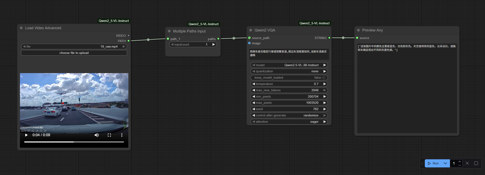

# Qwen2.5-VL-3B-Instruct Deployment Guide (ComfyUI + Intel GPU + Linux)

This document provides comprehensive instructions for deploying the `Qwen2.5-VL-3.5B-Instruct` multimodal LLM on Linux systems with `Intel GPU` acceleration via `ComfyUI` workflow.

## 🛠️ Installation Procedure
### 1. Environment Setup
```bash
# Install system dependencies
sudo apt update && sudo apt install -y \
    git python3-pip python3-venv \
    ocl-icd-opencl-dev

# Configure Intel GPU drivers (if not present)
sudo apt install -y \
    intel-opencl-icd \
    intel-level-zero-gpu \
    level-zero
```

### 2. Conda Environment Configuration
```bash
conda create -n comfyqwen python=3.11 
conda activate comfyqwen
```

### 3. ComfyUI Installation
```bash
git clone https://github.com/comfyanonymous/ComfyUI.git
cd ./ComfyUI

# Install Intel-optimized PyTorch
pip install torch torchvision torchaudio \
    --index-url https://download.pytorch.org/whl/xpu

# For nightly builds with potential performance improvements:
# pip install --pre torch torchvision torchaudio \
#     --index-url https://download.pytorch.org/whl/nightly/xpu

pip install -r requirements.txt
```

### 4. Qwen2.5-VL Custom Node Deployment
```bash
# Download node definition files
git clone https://github.com/IuvenisSapiens/ComfyUI_Qwen2_5-VL-Instruct

Move the ComfyUI_Qwen2_5-VL-Instruct folder into /ComfyUI/custom_nodes/ directory

Place the downloaded Qwen2.5-VL-3B-Instruct model folder into /ComfyUI/models/prompt_generator/
# If prompt_generator subdirectory doesn't exist under models, please create it first
```
<details><summary>ComfyUI_Qwen2_5-VL-Instruct_workflow.json</summary>
{
  "id": "9f2dfc63-3d19-433d-a7c0-49d83464f553",
  "revision": 0,
  "last_node_id": 59,
  "last_link_id": 72,
  "nodes": [
    {
      "id": 56,
      "type": "Qwen2_VQA",
      "pos": [
        199.93017578125,
        46.947696685791016
      ],
      "size": [
        322.1059265136719,
        348
      ],
      "flags": {},
      "order": 2,
      "mode": 0,
      "inputs": [
        {
          "name": "source_path",
          "shape": 7,
          "type": "PATH",
          "link": 70
        },
        {
          "name": "image",
          "shape": 7,
          "type": "IMAGE",
          "link": null
        }
      ],
      "outputs": [
        {
          "name": "STRING",
          "type": "STRING",
          "slot_index": 0,
          "links": [
            72
          ]
        }
      ],
      "properties": {
        "Node name for S&R": "Qwen2_VQA",
        "widget_ue_connectable": {}
      },
      "widgets_values": [
        "Describe the video in detail",
        "Qwen2.5-VL-3B-Instruct",
        "none",
        false,
        0.7,
        2048,
        200704,
        1003520,
        1444,
        "randomize",
        "eager"
      ]
    },
    {
      "id": 59,
      "type": "PreviewAny",
      "pos": [
        702.7207641601562,
        61.4115104675293
      ],
      "size": [
        140,
        76
      ],
      "flags": {},
      "order": 3,
      "mode": 0,
      "inputs": [
        {
          "name": "source",
          "type": "*",
          "link": 72
        }
      ],
      "outputs": [],
      "properties": {
        "Node name for S&R": "PreviewAny"
      },
      "widgets_values": []
    },
    {
      "id": 58,
      "type": "VideoLoader",
      "pos": [
        -513.0911254882812,
        130.9906768798828
      ],
      "size": [
        430.6719665527344,
        452.4115295410156
      ],
      "flags": {},
      "order": 0,
      "mode": 0,
      "inputs": [],
      "outputs": [
        {
          "name": "VIDEO",
          "type": "VIDEO",
          "links": null
        },
        {
          "name": "PATH",
          "type": "PATH",
          "links": [
            71
          ]
        }
      ],
      "properties": {
        "Node name for S&R": "VideoLoader",
        "widget_ue_connectable": {}
      },
      "widgets_values": [
        "19_raw.mp4",
        "image"
      ]
    },
    {
      "id": 57,
      "type": "MultiplePathsInput",
      "pos": [
        -49.730098724365234,
        137.55857849121094
      ],
      "size": [
        210,
        82
      ],
      "flags": {},
      "order": 1,
      "mode": 0,
      "inputs": [
        {
          "name": "path_1",
          "type": "PATH",
          "link": 71
        }
      ],
      "outputs": [
        {
          "name": "paths",
          "type": "PATH",
          "slot_index": 0,
          "links": [
            70
          ]
        }
      ],
      "properties": {
        "Node name for S&R": "MultiplePathsInput",
        "widget_ue_connectable": {}
      },
      "widgets_values": [
        1
      ]
    }
  ],
  "links": [
    [
      70,
      57,
      0,
      56,
      0,
      "PATH"
    ],
    [
      71,
      58,
      1,
      57,
      0,
      "PATH"
    ],
    [
      72,
      56,
      0,
      59,
      0,
      "*"
    ]
  ],
  "groups": [],
  "config": {},
  "extra": {
    "ds": {
      "scale": 0.9646149645000006,
      "offset": [
        788.9511067206646,
        382.6344411516708
      ]
    },
    "frontendVersion": "1.24.4",
    "ue_links": [],
    "links_added_by_ue": [],
    "VHS_latentpreview": false,
    "VHS_latentpreviewrate": 0,
    "VHS_MetadataImage": true,
    "VHS_KeepIntermediate": true
  },
  "version": 0.4
}
</details>

## 🚀 Launching ComfyUI
```bash
python main.py
```
Access the web interface at: `http://localhost:8188`

## Post-Installation Configuration
1. Replace the final component node with `Preview Any` in your workflow
2. Reference model path: `./models/prompt_generator/Qwen2.5-VL-3B-Instruct/`



## References
- [ComfyUI GitHub](https://github.com/comfyanonymous/ComfyUI)
- [Intel PyTorch XPU](https://intel.github.io/intel-extension-for-pytorch/)
- [Qwen2.5 Model Card](https://huggingface.co/Qwen/Qwen2.5-VL-3B-Instruct)

