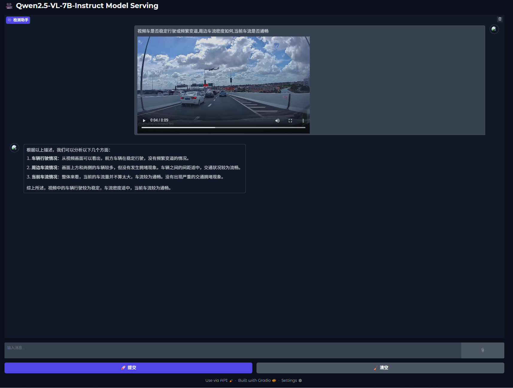

# Qwen2.5-VL-7B-Instruct Multimodal Deployment Guide (Intel GPU/Docker/Gradio)

 


## 📌 Core Components

- **Model**: Qwen2.5-VL-7B-Instruct (vision-language multimodal)
- **Inference Engine**: vLLM with Intel XPU optimizations
- **Interface**: Gradio WebUI
- **Deployment**: Docker containerized


## 🚀 Quick Deployment

### 1. Launch Docker Container
```bash
sudo docker run -td \
    --privileged \
    --net=host \
    --device=/dev/dri \
    --name=yourcontainername \
    -v /home/intel/LLM:/llm/models/ \
    -e no_proxy=localhost,127.0.0.1 \
    -e http_proxy=$http_proxy \
    -e https_proxy=$https_proxy \
    --shm-size="32g" \
    --entrypoint /bin/bash \
    intel/llm-scaler-vllm:latest
```

### 2. Start vLLM Service Inside Container
```bash
docker exec -it yourcontainername bash
```
```bash
TORCH_LLM_ALLREDUCE=1 \
VLLM_USE_V1=1 \
CCL_ZE_IPC_EXCHANGE=pidfd \
VLLM_ALLOW_LONG_MAX_MODEL_LEN=1 \
VLLM_WORKER_MULTIPROC_METHOD=spawn \
python3 -m vllm.entrypoints.openai.api_server \
    --model /llm/models/Qwen2.5-VL-7B-Instruct \
    --dtype=float16 \
    --device=xpu \
    --enforce-eager \
    --port 8000 \
    --host 0.0.0.0 \
    --trust-remote-code \
    --gpu-memory-util=0.9 \
    --no-enable-prefix-caching \
    --max-num-batched-tokens=8192 \
    --disable-log-requests \
    --max-model-len=32768 \
    --block-size 64 \
    --quantization fp8 \
    -tp=2
```

### 3. Launch Gradio Interface on Host
```bash
conda create -n qwen_gradio python=3.11
conda activate qwen_gradio
pip install gradio
```
```bash
python /llm-scaler/vllm/webui/multi-modal-gradio/main.py --model /llm/models/Qwen2.5-VL-7B-Instruct 
# The model need to be downloaded in advance to the directory
```

## 🌐 Access Interface
Open in browser: `http://<host_ip>:8003`



## 🔧 Key Parameters

### vLLM Server Flags
| Parameter | Purpose | Recommended Value |
|-----------|---------|-------------------|
| `--quantization fp8` | FP8 acceleration | Required |
| `-tp=2` | Tensor parallelism | Adjust based on GPU count |
| `--max-model-len` | Context window | 32768 |


## 📜 License
- Model: [Qwen License](https://huggingface.co/Qwen/Qwen2.5-VL-7B-Instruct)
- Code: `Apache-2.0`
